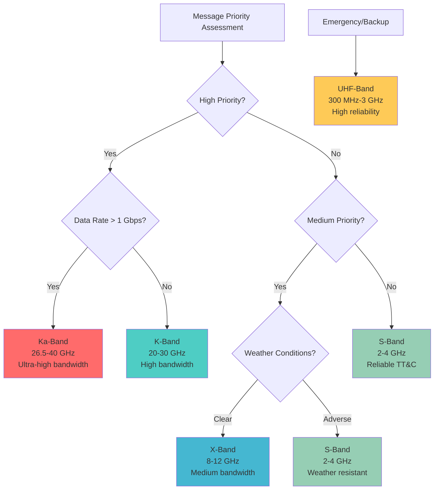
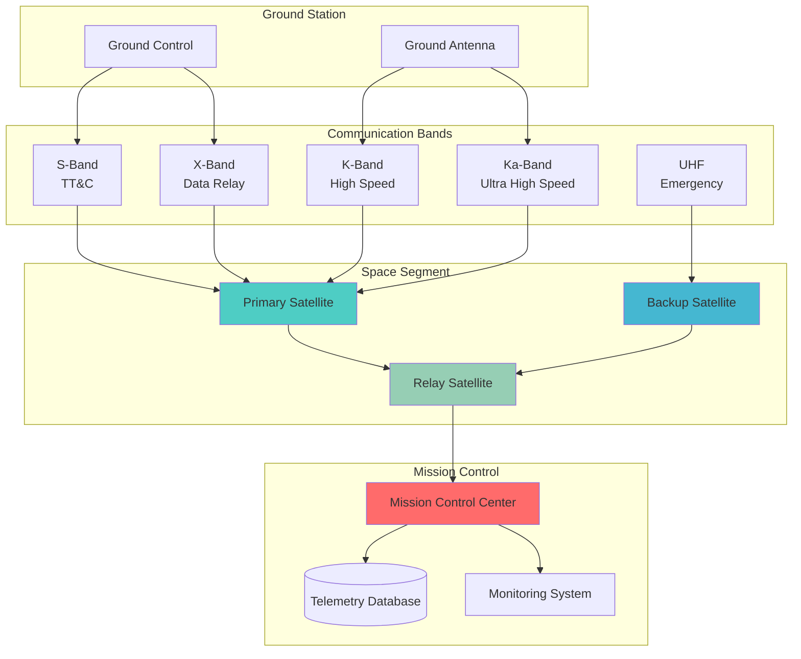
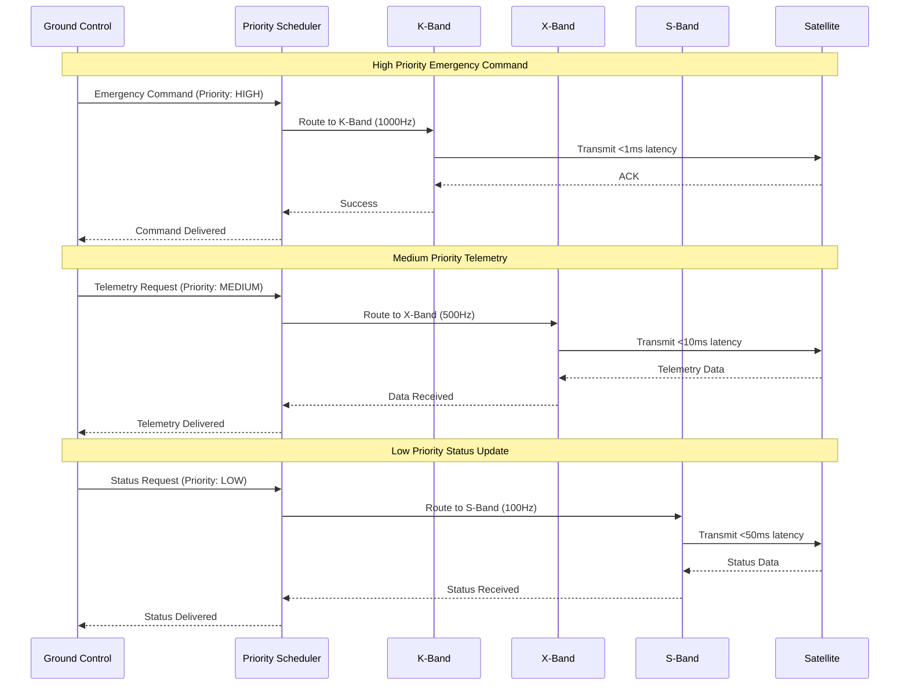
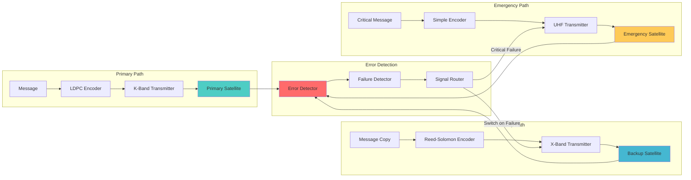
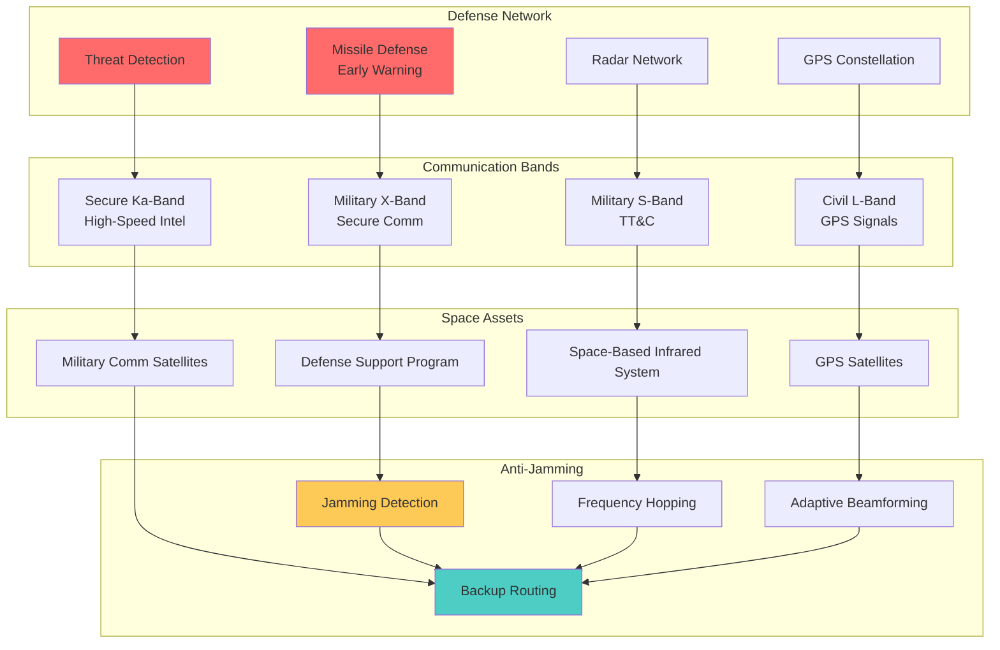
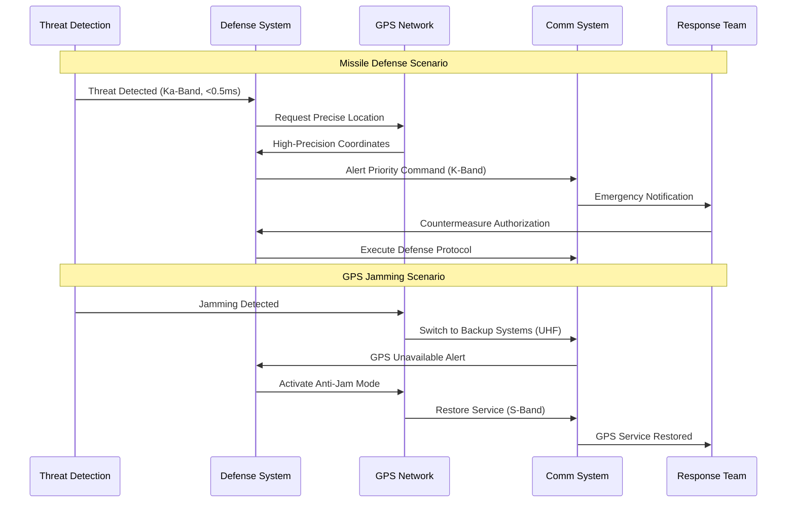

# Space Data Communication Analysis Project

[](https://github.com/username/space-data-project/actions)
[](https://coveralls.io/github/username/space-data-project?branch=main)
[](https://python.org)
[](https://opensource.org/licenses/MIT)

A comprehensive **Fault-Tolerant Priority-Based Space Communication System** designed to NASA standards for satellite communication analysis across multiple frequency bands (K-band, X-band, S-band) with emphasis on real-time priority messaging, advanced fault tolerance, and cutting-edge security features.

## 🚀 Project Overview

This project implements a sophisticated space data communication analysis system that adheres to NASA's CCSDS (Consultative Committee for Space Data Systems) standards while incorporating modern advances in:

- **Priority-Based Messaging**: Intelligent message scheduling with high/medium/low priority queues
- **Fault Tolerance**: Advanced LDPC error correction and redundancy mechanisms
- **Security**: Post-quantum cryptography and quantum key distribution
- **Real-Time Performance**: Support for high-frequency communication (1000Hz for critical telemetry)
- **NASA Compliance**: Full adherence to CCSDS protocols and NASA requirements documentation

### Key Features

- 🔄 **Adaptive Message Scheduling**: Process high-priority messages at 1000Hz with guaranteed latency <1ms
- 🛡️ **Advanced Error Correction**: LDPC-based error correction supporting recovery from 50%+ packet loss
- 🔐 **Quantum-Safe Security**: Post-quantum cryptography and simulated quantum key distribution
- 📊 **Real-Time Monitoring**: Grafana-based dashboard with Prometheus metrics collection
- 🌌 **Multi-Band Support**: K-band (18-27 GHz), X-band (8-12 GHz), and S-band (2-4 GHz) analysis
- ⚡ **High Performance**: <50ms latency for real-time analysis, 99.99% uptime target

## 📡 Communication Bands Overview

This system supports multiple frequency bands optimized for different space communication scenarios:

| Band | Frequency Range | Purpose | Advantages | Challenges |
|------|----------------|---------|------------|-----------|
| **K-Band** | 20 GHz – 30 GHz | High-speed data transmission | High data rates, compact antennas | Atmospheric attenuation (Earth links) |
| **Ka-Band** | 26.5 GHz – 40 GHz | High-bandwidth Earth and relay links | Very high bandwidth, efficient spectrum use | Rain fade, pointing accuracy requirements |
| **S-Band** | 2 GHz – 4 GHz | Telemetry, tracking, and command (TT&C) | Robust, reliable, low atmospheric loss | Lower data rates |
| **X-Band** | 8 GHz – 12 GHz | Medium-speed data transmission | Lower attenuation, global infrastructure | Moderate data rates, spectrum congestion |
| **UHF-Band** | 300 MHz – 3 GHz | Emergency communication and backup | High reliability, low power requirements | Limited bandwidth, interference |

### Band Selection Strategy



### Mission-Specific Band Usage

```mermaid
gantt
    title Communication Band Usage by Mission Phase
    dateFormat X
    axisFormat %s

    section Launch Phase
    S-Band TT&C          :active, s1, 0, 300
    UHF Backup          :uhf1, 0, 300

    section Orbit Operations
    K-Band Science Data  :k1, 300, 1800
    X-Band Telemetry    :x1, 300, 1800
    S-Band Commands     :s2, 300, 1800

    section Deep Space
    Ka-Band High-Rate   :ka1, 1800, 3600
    X-Band Medium-Rate  :x2, 1800, 3600
    S-Band Emergency    :s3, 1800, 3600

    section Emergency Mode
    UHF Low-Rate       :uhf2, 2400, 3600
    S-Band Backup      :s4, 2400, 3600
```



## 🏗️ Architecture

```
┌─────────────────────────────────────────────────────────────────┐
│                    Application Layer                           │
│  ┌─────────────────┐ ┌─────────────────┐ ┌─────────────────┐   │
│  │ Message Scheduler│ │ Telemetry Proc. │ │ Command Proc.   │   │
│  └─────────────────┘ └─────────────────┘ └─────────────────┘   │
├─────────────────────────────────────────────────────────────────┤
│                    Transport Layer                             │
│  ┌─────────────────┐ ┌─────────────────────────────────────┐   │
│  │ QUIC Protocol   │ │ CCSDS Encapsulation Protocol       │   │
│  └─────────────────┘ └─────────────────────────────────────┘   │
├─────────────────────────────────────────────────────────────────┤
│                    Network Layer                               │
│  ┌─────────────────────────────────────────────────────────┐   │
│  │              CCSDS Space Packet Protocol               │   │
│  └─────────────────────────────────────────────────────────┘   │
├─────────────────────────────────────────────────────────────────┤
│                    Data Link Layer                             │
│  ┌─────────────────┐ ┌─────────────────────────────────────┐   │
│  │ CCSDS Space     │ │ LDPC Error Correction               │   │
│  │ Data Link Proto │ │                                     │   │
│  └─────────────────┘ └─────────────────────────────────────┘   │
├─────────────────────────────────────────────────────────────────┤
│                    Physical Layer                              │
│  ┌─────────────────┐ ┌─────────────────────────────────────┐   │
│  │ Frequency Bands │ │ Adaptive Power & Bandwidth Alloc.   │   │
│  │ K/X/S-band      │ │                                     │   │
│  └─────────────────┘ └─────────────────────────────────────┘   │
└─────────────────────────────────────────────────────────────────┘
```

## 📁 Project Structure

```
space-data-project/
├── src/                          # Source code
│   ├── messaging/                # Priority-based messaging system
│   ├── fault_tolerance/          # Error correction and redundancy
│   ├── security/                 # Cryptography and authentication
│   ├── bands/                    # Communication band analysis
│   ├── utils/                    # Utility functions
│   ├── visualization/            # Data visualization components
│   └── monitoring/               # System monitoring and metrics
├── tests/                        # Test suites
├── docs/                         # Documentation
│   ├── project_plan.md          # Detailed project plan
│   ├── NASA-REQ-STD.md          # NASA requirements standard
│   └── NASA-DESIGN-STD.md       # NASA design standard
├── scripts/                      # Build and deployment scripts
├── data/                         # Data files and datasets
├── assets/                       # Static assets and resources
├── .github/                      # GitHub workflows and templates
├── .copilot/                     # GitHub Copilot configuration
├── .vscode/                      # VS Code settings
├── Dockerfile                    # Container configuration
├── docker-compose.yml           # Multi-service container setup
└── requirements.txt             # Python dependencies
```

## �️ System Architecture Diagrams

### High-Level System Overview



### Message Priority Flow



### Fault Tolerance Architecture



### Defense and GPS Integration



### Performance Metrics Dashboard

| Metric Category | K-Band | Ka-Band | X-Band | S-Band | UHF-Band |
|----------------|--------|---------|--------|--------|----------|
| **Data Rate** | 1-10 Gbps | 10-100 Gbps | 100 Mbps-1 Gbps | 1-100 Mbps | 1-10 Mbps |
| **Latency** | <1 ms | <0.5 ms | <10 ms | <50 ms | <100 ms |
| **Reliability** | 99.9% | 99.5% | 99.95% | 99.99% | 99.999% |
| **Power Required** | High | Very High | Medium | Low | Very Low |
| **Antenna Size** | Medium | Small | Large | Large | Very Large |
| **Weather Impact** | High | Very High | Medium | Low | Very Low |
| **Use Cases** | Science Data | Ultra-fast Relay | General Data | TT&C, Emergency | Backup, Rural |

## �🛠️ Installation

### Prerequisites

- Python 3.10 or higher
- Docker and Docker Compose
- Git

### Quick Start with Docker

1. **Clone the repository**
   ```bash
   git clone <repository-url>
   cd space-data-project
   ```

2. **Build and run with Docker Compose**
   ```bash
   docker-compose up --build
   ```

3. **Access the monitoring dashboard**
   - Grafana: http://localhost:3000
   - Prometheus: http://localhost:9090

### Local Development Setup

1. **Clone and navigate to project**
   ```bash
   git clone <repository-url>
   cd space-data-project
   ```

2. **Install Python dependencies**
   ```bash
   pip install -r requirements.txt
   ```

3. **Install development dependencies**
   ```bash
   pip install -r requirements-dev.txt
   ```

4. **Run tests**
   ```bash
   pytest tests/ --cov=src --cov-report=html
   ```

5. **Start the application**
   ```bash
   python -m src.main
   ```

## 🚀 Usage

### Basic Message Scheduling

```python
from src.messaging.priority_scheduler import MessageScheduler

# Initialize the scheduler
scheduler = MessageScheduler()

# Add messages with different priorities
scheduler.add_message("Critical telemetry data", "high", bandwidth_required=1000)
scheduler.add_message("Routine status update", "low", bandwidth_required=100)

# Process messages with available bandwidth
scheduler.process_messages(max_bandwidth=5000)
```

### Communication Band Analysis

```python
from src.bands.k_band import KBandAnalyzer

# Initialize K-band analyzer
k_band = KBandAnalyzer(frequency_range=(18e9, 27e9))

# Calculate signal-to-noise ratio
snr = k_band.calculate_snr(signal_power=100, noise_power=0.1)

# Analyze spectral efficiency
efficiency = k_band.spectral_efficiency(bandwidth=1e9, data_rate=10e9)
```

### Fault Tolerance

```python
from src.fault_tolerance.ldpc_error_correction import LDPCEncoder

# Initialize LDPC encoder
encoder = LDPCEncoder(code_rate=0.5)

# Encode data with error correction
encoded_data = encoder.encode(original_data)

# Simulate noisy channel and decode
decoded_data = encoder.decode(noisy_encoded_data)
```

## 🛡️ Defense and GPS Integration

### Missile Defense and Threat Detection

The system includes specialized modules for defense applications:

```python
from src.defense.missile_defense import MissileDefenseSystem
from src.defense.threat_detection import ThreatAnalyzer
from src.defense.gps_integration import GPSNavigation

# Initialize defense systems
defense_system = MissileDefenseSystem()
threat_analyzer = ThreatAnalyzer()
gps_nav = GPSNavigation()

# Detect and track potential threats
threat_data = threat_analyzer.detect_threats(radar_data, infrared_data)
trajectory = defense_system.predict_trajectory(threat_data)

# GPS spoofing detection and mitigation
gps_signals = gps_nav.receive_signals()
if gps_nav.detect_spoofing(gps_signals):
    gps_nav.activate_anti_spoofing_mode()
    backup_position = gps_nav.get_inertial_navigation()
```

### Anti-Jamming and Resilience Features

| Feature | Implementation | Benefit |
|---------|---------------|---------|
| **Frequency Hopping** | Pseudo-random frequency changes | Prevents jamming attacks |
| **Adaptive Beamforming** | Null steering toward jammers | Maintains signal quality |
| **Error Correction** | LDPC + Reed-Solomon | Recovers from 50%+ packet loss |
| **Backup Routing** | Multiple satellite paths | Continues operation during attacks |
| **Encryption** | Post-quantum cryptography | Quantum-resistant security |

### Defense Communication Scenarios



## 🧪 Testing

### Running Tests

```bash
# Run all tests
pytest

# Run with coverage
pytest --cov=src --cov-report=html

# Run specific test modules
pytest tests/test_messaging/
pytest tests/test_fault_tolerance/
pytest tests/test_security/

# Run performance benchmarks
pytest tests/performance/ -v
```

### Test Categories

- **Unit Tests**: Individual component testing
- **Integration Tests**: End-to-end communication scenarios
- **Performance Tests**: Latency and throughput validation
- **Security Tests**: Penetration testing and vulnerability assessment
- **Fault Tolerance Tests**: Failure scenario simulation

## 📊 Monitoring and Metrics

The system provides comprehensive monitoring through:

- **Grafana Dashboard**: Real-time visualization of system metrics
- **Prometheus Metrics**: Time-series data collection
- **Custom Alerts**: Intelligent alerting for system anomalies
- **Performance Analytics**: Predictive models for bottleneck detection

### Key Metrics

- Message processing rates (messages/second)
- Communication latency (milliseconds)
- Error rates and correction efficiency
- Bandwidth utilization across frequency bands
- System resource usage (CPU, memory, network)

## 🔒 Security

### Security Features

- **Post-Quantum Cryptography**: Lattice-based encryption algorithms
- **Quantum Key Distribution**: BB84 protocol simulation
- **Mutual TLS**: Certificate-based authentication
- **Message Integrity**: HMAC verification
- **Intrusion Detection**: AI-based anomaly detection

### Security Best Practices

- All sensitive data encrypted in transit and at rest
- Regular security audits and penetration testing
- Principle of least privilege for system access
- Comprehensive audit logging and monitoring

## 🤝 Contributing

We welcome contributions from the community! Please follow these steps:

1. **Fork the repository**
2. **Create a feature branch** (`git checkout -b feature/amazing-feature`)
3. **Make your changes** following the coding standards
4. **Add tests** for your changes
5. **Run the test suite** (`pytest`)
6. **Update documentation** as needed
7. **Commit your changes** (`git commit -m 'Add amazing feature'`)
8. **Push to the branch** (`git push origin feature/amazing-feature`)
9. **Open a Pull Request**

### Development Guidelines

- Follow PEP 8 style guidelines for Python code
- Maintain test coverage above 95%
- Use type hints for all function signatures
- Include docstrings for all public functions and classes
- Follow NASA coding standards for space applications

## 📋 Requirements

### System Requirements

- **Operating System**: Linux (Ubuntu 20.04+), macOS 10.15+, Windows 10+
- **Python**: 3.10 or higher
- **Memory**: Minimum 8GB RAM (16GB recommended)
- **Storage**: 10GB free space for data and logs
- **Network**: Broadband internet for external data sources

### Software Dependencies

- NumPy, SciPy (numerical computing)
- Matplotlib, Plotly (visualization)
- asyncio (asynchronous programming)
- cryptography (security features)
- pytest (testing framework)
- Docker (containerization)

## 📄 License

This project is licensed under the MIT License - see the [LICENSE](LICENSE) file for details.

## 🙏 Acknowledgments

- NASA for the CCSDS standards and space communication protocols
- The open-source community for the excellent libraries and tools
- Contributors and maintainers of this project

## 📞 Support

For questions, issues, or contributions:

- **Issues**: Use the GitHub issue tracker
- **Discussions**: Join the GitHub discussions
- **Documentation**: Check the `/docs` directory for detailed information
- **Project Plan**: See `docs/project_plan.md` for development roadmap

---

**Note**: This project is designed for educational and research purposes in space communication systems. For production deployment in actual space missions, additional validation and certification processes would be required.
