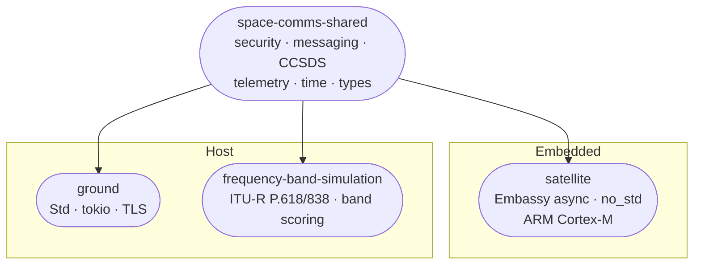
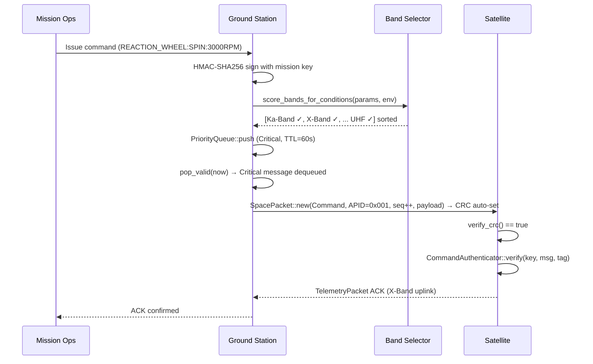
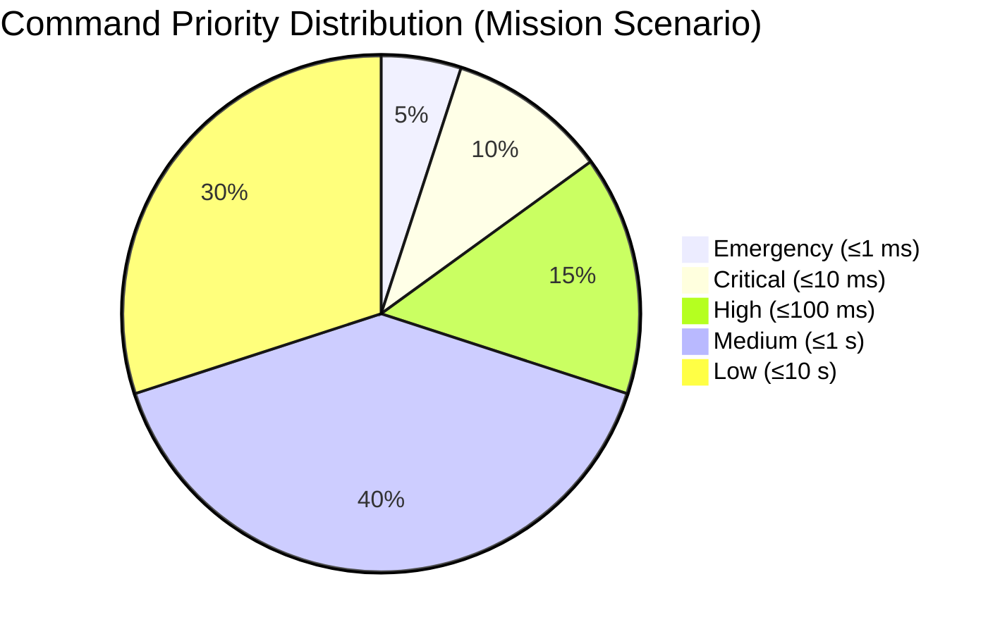
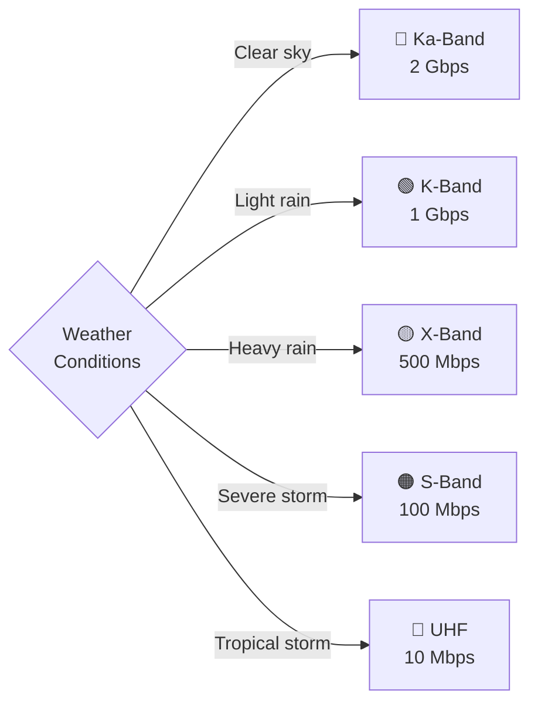
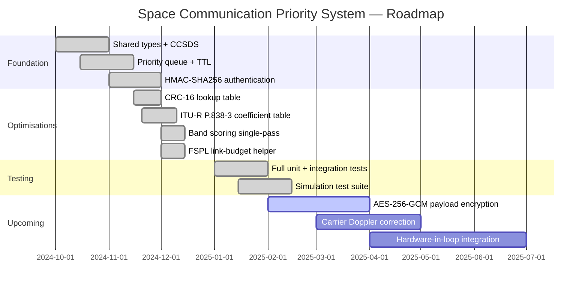

<div align="center">

# 🛰 Space Communication Priority System

<em>Mission-critical, priority-aware satellite communication framework built in Rust</em>

[](LICENSE)
[](https://www.rust-lang.org/)
[](https://embassy.dev/)
[](https://public.ccsds.org/pubs/133x0b2e1.pdf)
[](https://tools.ietf.org/html/rfc2104)
[](https://docs.rs/heapless)

</div>

---

## Table of Contents

- [Overview](#overview)
- [Key Features](#key-features)
- [Architecture](#architecture)
- [Command Flow](#command-flow)
- [Priority Distribution](#priority-distribution)
- [Technology Stack](#technology-stack)
- [Frequency Bands](#frequency-bands)
- [Setup & Installation](#setup--installation)
- [Running the Tests](#running-the-tests)
- [Development Roadmap](#development-roadmap)
- [Project Structure](#project-structure)
- [Contributing](#contributing)
- [License](#license)

---

## Overview

The **Space Communication Priority System** is a Rust workspace implementing a standards-compliant,
real-time command and telemetry framework for satellite–ground communication. It models five
frequency bands with physics-based atmospheric propagation, encodes packets in the CCSDS Space
Packet Protocol, authenticates commands with HMAC-SHA256, and dispatches them through a
`heapless` priority queue with five priority tiers and TTL enforcement.

The workspace targets both embedded `no_std` environments (ARM Cortex-M via Embassy) and standard
Linux/macOS ground-station software.

> [!NOTE]
> All packet construction auto-computes CRC-16/CCITT-FALSE at the point of `SpacePacket::new()`.
> Callers cannot produce an unauthenticated packet by omission.

> [!TIP]
> Emergency-priority messages have a maximum acceptable latency of **1 ms**.
> Use `pop_valid(current_time_secs)` instead of `pop()` to enforce TTL expiry
> so stale safety-critical commands are never executed.

> [!IMPORTANT]
> The satellite crate targets `thumbv7em-none-eabihf` (ARM Cortex-M4/M7 with FPU). Add this
> target before attempting a cross-compile: `rustup target add thumbv7em-none-eabihf`.

---

## Key Features

| Feature | Status | Description |
|---|---|---|
| CCSDS Space Packet Protocol | ✅ Stable | Header + PEC per CCSDS 133.0-B-2 |
| Auto-CRC on construction | ✅ Stable | Every `SpacePacket::new()` instantly verifiable |
| 5-Tier Priority Queue | ✅ Stable | Emergency → Critical → High → Medium → Low |
| TTL-enforced dequeue | ✅ Stable | `pop_valid()` discards expired messages silently |
| HMAC-SHA256 authentication | ✅ Stable | `CommandAuthenticator::sign / verify` (FIPS 198-1) |
| Multi-band RF simulation | ✅ Stable | UHF / S / X / K / Ka + ITU-R P.618 rain model |
| Band scoring engine | ✅ Stable | `score_bands_for_conditions()` — single-pass ranking |
| Atmospheric ITU-R P.838-3 | ✅ Stable | Compile-time coefficient table, O(17) scan |
| CRC-16 lookup table | ✅ Stable | 512-byte ROM table, ~8× faster than bit-loop |
| No-heap satellite crate | ✅ Stable | Embassy async, fully `no_std`, Cortex-M target |
| FSPL link-budget helper | ✅ Stable | `BandType::free_space_path_loss_db(distance_km)` |
| Full test suite | ✅ Stable | Unit + integration + stress + simulation tests |

---

## Architecture

The workspace is divided into four crates with a strict dependency hierarchy:


```mermaid
flowchart TD
    SHARED([space-comms-shared\nsecurity · messaging · CCSDS\ntelemetry · time · types])

    SAT([satellite\nEmbassy async · no_std\nARM Cortex-M])
    GND([ground\nStd · tokio · TLS])
    SIM([frequency-band-simulation\nITU-R P.618/838 · band scoring])

    SHARED --> SAT
    SHARED --> GND
    SHARED --> SIM

    subgraph Embedded
        SAT
    end

    subgraph Host
        GND
        SIM
    end
```

### Crate Responsibilities

| Crate | Targets | Responsibility |
|---|---|---|
| `space-comms-shared` | `std` + `no_std` | Protocol types, queue, security, CCSDS, telemetry |
| `satellite` | `thumbv7em-none-eabihf` | Embassy firmware, HW abstraction, RF driver |
| `ground` | Linux/macOS | Uplink/downlink server, TLS, mission control |
| `frequency-band-simulation` | Linux/macOS | Frequency band simulation, link budget, band ranking |

<div align="right"><a href="#table-of-contents">↑ Back to top</a></div>

---

## Command Flow

The following sequence shows a complete ground-to-satellite command cycle including
authentication, priority queuing, TTL-enforced dequeue, CCSDS encapsulation, and telemetry ack:


```mermaid
sequenceDiagram
    participant OPS as Mission Ops
    participant GND as Ground Station
    participant SIM as Band Selector
    participant SAT as Satellite

    OPS->>GND: Issue command (REACTION_WHEEL:SPIN:3000RPM)
    GND->>GND: HMAC-SHA256 sign with mission key
    GND->>SIM: score_bands_for_conditions(params, env)
    SIM-->>GND: [Ka-Band ✓, X-Band ✓, ... UHF ✓] sorted
    GND->>GND: PriorityQueue::push (Critical, TTL=60s)
    GND->>GND: pop_valid(now) → Critical message dequeued
    GND->>SAT: SpacePacket::new(Command, APID=0x001, seq++, payload) → CRC auto-set
    SAT->>SAT: verify_crc() == true
    SAT->>SAT: CommandAuthenticator::verify(key, msg, tag)
    SAT-->>GND: TelemetryPacket ACK (X-Band uplink)
    GND-->>OPS: ACK confirmed
```

<div align="right"><a href="#table-of-contents">↑ Back to top</a></div>

---

## Priority Distribution

Typical mission command mix across priority tiers (from stress-test scenario data):


```mermaid
pie title Command Priority Distribution (Mission Scenario)
    "Emergency (≤1 ms)" : 5
    "Critical (≤10 ms)" : 10
    "High (≤100 ms)" : 15
    "Medium (≤1 s)" : 40
    "Low (≤10 s)" : 30
```

> [!WARNING]
> The queue has a **fixed compile-time capacity** (e.g., `PriorityQueue::<64>::new()`).
> Pushing beyond capacity returns `Err` — never panics. Size must be chosen at compile time
> for embedded targets. Stack-overflow risk is zero; heap allocation is zero.

<div align="right"><a href="#table-of-contents">↑ Back to top</a></div>

---

## Technology Stack

The table below summarises every dependency and its role. Detailed explanations of the design
decisions behind each choice follow.

| Technology | Version | Crate(s) | Role |
|---|---|---|---|
| Rust | 1.70+ | all | Systems language — memory safety + `no_std` |
| Embassy | 0.2+ | `satellite` | Embedded async executor on Cortex-M |
| heapless | 0.7 | `shared`, `satellite` | Allocation-free data structures |
| HMAC + SHA-2 | 0.12 / 0.10 | `shared` | FIPS 198-1 command authentication |
| serde | 1.0 | `shared`, `simulation` | Packet serialisation / deserialisation |
| tokio | 1.36 | `ground` | Async I/O for the ground-station process |
| rustls | 0.21 | `ground` | Memory-safe TLS for relay links |
| rand | 0.8 | `simulation` | Stochastic atmospheric model |
| criterion | 0.5 | dev | Statistical micro-benchmarks |
| approx | 0.5 | dev | ULP-precise float assertions |

---

### Rust

**Why:** Space and defence systems demand both correctness guarantees and low-level hardware
access. Rust provides compile-time memory safety (no null-pointer dereferences, no
use-after-free, no data races) without a garbage collector — critical because garbage-collection
pauses are incompatible with the 1 ms Emergency-priority latency budget. The `no_std` mode lets
the same codebase compile for a bare-metal satellite microcontroller and a Linux ground server.

**What it does here:** Every crate is written in Rust. The `shared` crate compiles under both
`std` and `no_std` feature flags, controlled by `Cargo.toml`:

```toml
[features]
default = ["std"]
std     = []
no-std  = ["heapless/ufmt-impl"]
```

**How it does it:** The workspace-level `Cargo.toml` sets `unsafe_code = "forbid"` as a lint,
making any `unsafe` block a compile error. The borrow checker statically proves that the
priority queue can never be mutated from two threads simultaneously without explicit
synchronisation. The `const fn` feature is used for compile-time CRC table generation
(`CRC16_TABLE: [u16; 256]`) and for the ITU-R P.838-3 coefficient array — zero runtime cost.

---

### Embassy

**Why:** The satellite firmware requires concurrent tasks — reading sensors, servicing the RF
transceiver, running a watchdog timer — but the target microcontroller (ARM Cortex-M4/M7) has
no operating system. Traditional RTOS approaches require dynamic heap allocation and non-trivial
porting effort. Embassy provides a cooperative async executor that runs entirely in static memory.

**What it does here:** The `satellite` crate's `main.rs` is an Embassy entry point. Each
hardware interaction (UART telemetry read, SPI transceiver write, watchdog kick) becomes an
`async fn` that can yield to other tasks without blocking the processor.

**How it does it:** Embassy uses Rust's `async`/`await` syntax compiled down to state machines
by `rustc`. There is no heap; all task state lives in statically-sized stack frames. The
executor polls futures in a cooperative loop, waking them only when hardware interrupts fire —
meaning the CPU is idle (low-power sleep) whenever no work is pending. The target triple
`thumbv7em-none-eabihf` tells the linker there is no OS system call layer.

---

### heapless

**Why:** On the satellite's Cortex-M target there is no allocator — `alloc` is not available.
The priority queue that dispatches commands must still hold up to _N_ messages ranked by
priority, without ever calling `malloc`. A standard `BinaryHeap<T>` from `std` is unusable.

**What it does here:** `heapless::BinaryHeap<PriorityMessage, Max, N>` backs the
`PriorityQueue<N>` struct in `shared/src/messaging.rs`. All packet payload buffers
(`heapless::Vec<u8, 2048>`), command parameter lists (`heapless::Vec<u8, 256>`), and alert
description strings (`heapless::String<256>`) use heapless types throughout the shared crate.

**How it does it:** `heapless` stores its elements in a fixed-size array on the stack or in a
`static`. The binary heap invariant (parent ≥ children) is maintained by standard sift-up /
sift-down operations, identical to `std::BinaryHeap` but bounded at compile time. The generic
parameter `N` makes the capacity a type-level constant, so exceeding it is a compile-time or
explicit `Err` at runtime — never a panic, never undefined behaviour.

---

### HMAC + SHA-2 (`hmac` + `sha2` crates)

**Why:** Commands uplinked to a spacecraft must be authenticated. An adversary who can inject
an unauthenticated `EmergencyAbort` command could destroy a mission. A message authentication
code (MAC) proves both the identity of the sender (they hold the shared secret key) and the
integrity of the payload (any bit-flip invalidates the tag). HMAC-SHA256 is the FIPS 198-1
standard algorithm, widely used in aerospace command authentication.

**What it does here:** `CommandAuthenticator` in `shared/src/security.rs` wraps both crates.
`sign(key, message) -> AuthTag` computes the 32-byte HMAC tag. `verify(key, message, tag) ->
bool` recomputes the tag and compares in constant time (no early-exit timing leak).

**How it does it:** HMAC-SHA256 pads the key to the SHA-256 block size (64 bytes), XORs it
with the `ipad` constant, hashes the concatenation with the message, then XORs the key with
`opad` and hashes again — a two-pass construction that prevents length-extension attacks.
Both crates are `no_std` compatible, so authentication runs on the satellite firmware as well
as on the ground server. An empty key is explicitly rejected (`Err`) to prevent trivially weak
authentication.

---

### serde

**Why:** Packets and telemetry frames must be serialised to bytes for transmission over the RF
link and deserialised on the other end. Hand-rolling encoding logic for every struct is
error-prone and introduces deserialization bugs — a major source of mission failures. `serde`
provides a derive-macro approach that keeps the canonical type definition and its serialisation
logic co-located.

**What it does here:** Every public type in `shared` (`Message`, `SpacePacket`,
`TelemetryPacket`, `SpaceCommand`, `HealthStatus`, etc.) derives `Serialize + Deserialize`.
The CCSDS `SpacePacket::to_bytes()` calls `header.to_bytes()` (manual big-endian encoding per
the standard) and then appends the `data` field — with serde used for higher-level diagnostic
and logging serialisation via `serde_json`.

**How it does it:** The `#[derive(Serialize, Deserialize)]` macro generates trait
implementations at compile time. No reflection, no vtables, no runtime type information — the
generated code is equivalent to hand-written match statements over each field. This makes
encode/decode zero-overhead on release builds.

---

### tokio

**Why:** The ground station must handle multiple simultaneous connections: an uplink session
receiving commands from mission control, a downlink session receiving telemetry from the
satellite, optionally a relay to a secondary ground station, and an HTTP health endpoint.
Blocking one of these on a slow I/O call would stall the entire loop. An async runtime
multiplexes all connections onto a small thread pool without the overhead of one-thread-per-connection.

**What it does here:** The `ground` crate's `main.rs` runs under the `#[tokio::main]` macro.
TCP accept loops, TLS handshakes, and CCSDS frame reads are all `async fn` awaited inside
tokio tasks. The `PriorityQueue` is wrapped in a `tokio::sync::Mutex` so uplink and downlink
tasks share it safely.

**How it does it:** tokio uses an M:N scheduler — M async tasks mapped onto N OS threads
(typically one per CPU core). I/O readiness is driven by `epoll` on Linux. When a socket has
no data, the task is parked (no CPU consumed) until the kernel wakes it via an event. This
gives the ground station the ability to sustain hundreds of concurrent connections with memory
proportional to active work, not total connections.

---

### rustls

**Why:** Commands and telemetry transiting the RF-to-internet relay leg must be encrypted and
authenticated at the transport layer to prevent eavesdropping and man-in-the-middle injection.
OpenSSL is the traditional choice but it is written in C, has a long history of memory-safety
CVEs (Heartbleed, etc.), and is difficult to audit. `rustls` provides TLS 1.3 implemented
entirely in safe Rust.

**What it does here:** The ground-to-relay TCP connection in the `ground` crate wraps its
`TcpStream` in a `rustls::StreamOwned<ClientConnection, TcpStream>`, giving transparent
encryption over all CCSDS packet bytes transmitted to the relay server.

**How it does it:** `rustls` implements TLS 1.3 handshake (key exchange via X25519 ECDH,
authentication via Ed25519 certificates), bulk encryption (AES-256-GCM), and record-layer
framing in pure safe Rust. It uses the `ring` crate for cryptographic primitives. Because
there is no `unsafe` in `rustls` itself, entire classes of buffer-overflow and
use-after-free vulnerabilities are structurally impossible.

---

### rand

**Why:** The atmospheric simulation must model stochastic weather phenomena — rain-cell
distribution, scintillation variance, ionospheric turbulence — that are inherently random.
A deterministic sine-wave approximation would under-sample worst-case conditions used in
link-budget margin planning.

**What it does here:** `simulation/src/atmospheric.rs` uses `rand` to sample rain-rate
distributions for Monte Carlo link-availability predictions and to generate synthetic
scintillation time-series for testing fade-margin calculations.

**How it does it:** `rand` separates the RNG algorithm (`ChaCha8Rng` — fast, cryptographically
secure) from the sampling layer (`distributions::Normal`, `distributions::Uniform`). The
simulation seeds the RNG from a fixed seed in tests (deterministic) and from
`rand::thread_rng()` (OS entropy) in production runs.

---

### criterion (dev)

**Why:** The CRC-16 lookup-table optimisation and the single-pass band-scoring refactor
(`score_bands_for_conditions`) each claim a significant performance improvement. Without a
statistical benchmarking framework, "it feels faster" is not a measurable claim.

**What it does here:** Micro-benchmarks in the `benches/` directory measure CRC throughput
(bytes/second before and after the lookup table) and band-scoring latency across queue sizes.

**How it does it:** criterion runs each benchmark in a calibrated loop, collects wall-clock
samples, computes mean ± standard deviation, and reports regression against a previously saved
baseline. It uses Welch's t-test to distinguish genuine regressions from measurement noise.

---

### approx (dev)

**Why:** The link-budget calculations (`free_space_path_loss_db`, rain attenuation, SNR) produce
floating-point results. Comparing floats with `==` is incorrect due to rounding; comparing with
a hard-coded epsilon is fragile across platforms. `approx` provides ULP (units in the last place)
and relative-epsilon assertion macros standardised for IEEE 754.

**What it does here:** Simulation integration tests use `assert_relative_eq!(fspl, expected,
epsilon = 0.01)` to assert that band-scoring results are within 0.01 dB of the expected
link-budget value, regardless of compiler optimisation level or FPU rounding mode.

**How it does it:** `approx::relative_eq!(a, b, epsilon = e)` computes
`|a − b| / max(|a|, |b|) < e`, which is scale-invariant and correct for both very large and
very small floating-point values — unlike an absolute epsilon which would pass accidentally for
large numbers or fail spuriously for small ones.

---

## Frequency Bands

The simulation crate models five ITU standardised bands.
`score_bands_for_conditions()` performs a single-pass evaluation and returns all bands
ranked by composite utility score (0 = unusable, 1 = optimal):

| Band | Range | Max Rate | Rain Sensitivity | Best For |
|---|---|---|---|---|
| **UHF** | 0.3–3 GHz | 10 Mbps | Very Low | Emergency backup, all-weather ops |
| **S-Band** | 2–4 GHz | 100 Mbps | Low | TT&C, routine telemetry |
| **X-Band** | 8–12 GHz | 500 Mbps | Medium | Science data downlink |
| **K-Band** | 20–30 GHz | 1 Gbps | High | High-rate data relay |
| **Ka-Band** | 26.5–40 GHz | 2 Gbps | Very High | Maximum bandwidth, clear sky |


```mermaid
flowchart LR
    ENV{Weather\nConditions}
    ENV -->|Clear sky| KA["🔵 Ka-Band\n2 Gbps"]
    ENV -->|Light rain| KB["🟢 K-Band\n1 Gbps"]
    ENV -->|Heavy rain| XB["🟡 X-Band\n500 Mbps"]
    ENV -->|Severe storm| SB["🟠 S-Band\n100 Mbps"]
    ENV -->|Tropical storm| UHF["🔴 UHF\n10 Mbps"]
```

<div align="right"><a href="#table-of-contents">↑ Back to top</a></div>

---

## Setup & Installation

### Prerequisites

- Rust 1.70+ (`curl --proto '=https' --tlsv1.2 -sSf https://sh.rustup.rs | sh`)
- Embedded cross-compile target (satellite crate only):
  ```bash
  rustup target add thumbv7em-none-eabihf
  ```

### Build

```bash
cd rust-workspace

# Build all workspace members
cargo build --workspace

# Build only the shared library
cargo build -p space-comms-shared

# Build only the simulation library
cargo build -p frequency-band-simulation

# Cross-compile satellite firmware (requires Cortex-M target)
cargo build -p satellite --target thumbv7em-none-eabihf
```

### Run Demonstrations

```bash
# Frequency-band simulation demo (clear-sky vs storm band ranking)
cargo run -p frequency-band-simulation

# Ground station (requires running satellite simulation)
cargo run -p ground
```

<div align="right"><a href="#table-of-contents">↑ Back to top</a></div>

---

## Running the Tests

The project ships four test suites:

### Quick test all

```bash
cd rust-workspace
cargo test --workspace
```

### Per-crate tests

```bash
# Shared library — unit + integration + security + CCSDS + TTL enforcement
cargo test -p space-comms-shared

# Simulation crate — band scoring, ITU-R model, link budgets
cargo test -p frequency-band-simulation
```

### Test Coverage Summary

<details>
<summary>Show test matrix (click to expand)</summary>

| Test File | Crate | Test Count | Coverage Area |
|---|---|---|---|
| `shared/tests/full_suite.rs` | `space-comms-shared` | ~55 tests | CCSDS, queue, security, bands, time, telemetry, errors |
| `shared/tests/integration_tests.rs` | `space-comms-shared` | ~35 tests | End-to-end lifecycle, full command pipeline |
| `simulation/tests/simulation_tests.rs` | `frequency-band-simulation` | ~22 tests | Band scoring, physics invariants, determinism |
| `tests/priority_stress_tests.rs` | reference | — | Async stress, mission scenario playbooks |

</details>

<details>
<summary>Show key test invariants (click to expand)</summary>

- **Auto-CRC**: `SpacePacket::new()` → `verify_crc() == true` (no additional call needed)
- **TTL enforcement**: expired Emergency silently discarded; valid Low surfaces via `pop_valid()`
- **Priority order**: Emergency → Critical → High → Medium → Low always preserved by heap
- **HMAC security**: tampered message/wrong key both produce `verify() == false`
- **Band scoring**: Ka-Band wins in clear sky; UHF wins in 100 mm/hr storm
- **FSPL monotonicity**: FSPL increases with distance and with centre frequency
- **Queue overflow**: `push()` beyond capacity returns `Err`, never panics

</details>

<div align="right"><a href="#table-of-contents">↑ Back to top</a></div>

---

## Development Roadmap


```mermaid
gantt
    title Space Communication Priority System — Roadmap
    dateFormat  YYYY-MM-DD
    section Foundation
    Shared types + CCSDS           :done,   f1, 2024-10-01, 2024-11-01
    Priority queue + TTL           :done,   f2, 2024-10-15, 2024-11-15
    HMAC-SHA256 authentication     :done,   f3, 2024-11-01, 2024-12-01
    section Optimisations
    CRC-16 lookup table            :done,   o1, 2024-11-15, 2024-12-01
    ITU-R P.838-3 coefficient table:done,   o2, 2024-11-20, 2024-12-10
    Band scoring single-pass       :done,   o3, 2024-12-01, 2024-12-15
    FSPL link-budget helper        :done,   o4, 2024-12-01, 2024-12-15
    section Testing
    Full unit + integration tests  :done,   t1, 2025-01-01, 2025-02-01
    Simulation test suite          :done,   t2, 2025-01-15, 2025-02-15
    section Upcoming
    AES-256-GCM payload encryption :active, u1, 2025-02-01, 2025-04-01
    Carrier Doppler correction      :        u2, 2025-03-01, 2025-05-01
    Hardware-in-loop integration    :        u3, 2025-04-01, 2025-07-01
```

<div align="right"><a href="#table-of-contents">↑ Back to top</a></div>

---

## Project Structure

```
rust-workspace/
├── Cargo.toml                  # Workspace manifest
├── shared/                     # Core shared library (std + no_std)
│   ├── src/
│   │   ├── lib.rs              # Module root + re-exports
│   │   ├── ccsds.rs            # CCSDS Space Packet + CRC-16 lookup table
│   │   ├── messaging.rs        # PriorityQueue, Message, pop_valid()
│   │   ├── security.rs         # CommandAuthenticator (HMAC-SHA256)
│   │   ├── telemetry.rs        # TelemetryPacket + measurements
│   │   ├── commands.rs         # 25-command SpaceCommand catalog
│   │   ├── types.rs            # BandType, ComponentId, HealthStatus, FSPL
│   │   ├── error.rs            # SpaceCommError + MemoryErrorType
│   │   └── time.rs             # Timestamp, Duration, current_time_nanos()
│   └── tests/
│       ├── full_suite.rs       # Comprehensive unit + module tests (~55 tests)
│       └── integration_tests.rs# End-to-end integration tests (~35 tests)
├── simulation/                 # RF propagation simulation (std only)
│   ├── src/
│   │   ├── lib.rs              # FrequencyBand, BandScore, score_bands_for_conditions()
│   │   ├── atmospheric.rs      # RainFadeModel — ITU-R P.618/838
│   │   ├── bands.rs            # Extended band definitions
│   │   └── interference.rs     # Interference + Doppler models
│   └── tests/
│       └── simulation_tests.rs # Band scoring + physics invariants (~22 tests)
├── satellite/                  # Embedded firmware (no_std, Cortex-M)
│   └── src/
│       ├── main.rs             # Embassy async entry point
│       ├── communication.rs    # RF + protocol driver
│       └── hardware.rs         # HAL abstraction
├── ground/                     # Ground station daemon (std + tokio)
│   └── src/
│       └── main.rs             # Uplink/downlink server
└── tests/                      # Workspace-level reference test files
    ├── integration_tests.rs    # System integration reference
    └── priority_stress_tests.rs# Async stress + mission scenario playbooks

config/
├── requirements.txt            # Python runtime dependencies
└── requirements-dev.txt        # Python development dependencies

scripts/
└── deprecated/                 # One-time migration scripts (archived)
```

<details>
<summary>Show full command catalog (click to expand)</summary>

The `SpaceCommand` enum in `shared/src/commands.rs` defines **25 mission commands**
classified across five priority tiers:

| Priority | Command | Latency Requirement |
|---|---|---|
| Emergency | `EmergencyAbort` | ≤1 ms |
| Emergency | `EmergencyHalt` | ≤1 ms |
| Emergency | `ActivateSafeMode` | ≤1 ms |
| Critical | `AbortMission` | ≤10 ms |
| Critical | `CollisionAvoidance` | ≤10 ms |
| Critical | `AttitudeControl` | ≤10 ms |
| Critical | `PowerManagement` | ≤10 ms |
| High | `UpdateOrbit` | ≤100 ms |
| High | `ReconfigureComm` | ≤100 ms |
| High | `DeployInstrument` | ≤100 ms |
| High | `AdjustAntenna` | ≤100 ms |
| High | `ThermalControl` | ≤100 ms |
| Medium | `RequestTelemetry` | ≤1 s |
| Medium | `UpdateConfiguration` | ≤1 s |
| Medium | `CalibrateInstrument` | ≤1 s |
| Medium | `StartDataCollection` | ≤1 s |
| Medium | `StopDataCollection` | ≤1 s |
| Low | `SendStatusReport` | ≤10 s |
| Low | `UpdateTimeSync` | ≤10 s |
| Low | `PerformMaintenance` | ≤10 s |
| Low | `ScheduleActivity` | ≤10 s |
| Low | `DownloadLogs` | ≤10 s |
| Low | `UpdateSoftware` | ≤10 s |
| Low | `DiagnosticScan` | ≤10 s |
| Low | `ArchiveData` | ≤10 s |

</details>

<div align="right"><a href="#table-of-contents">↑ Back to top</a></div>

---

## Contributing

Contributions are welcome. Please follow these guidelines:

1. Follow the existing Rust formatting: `cargo fmt --all`
2. Ensure `cargo clippy --workspace -- -D warnings` passes
3. Add structured mission-critical comments to any new public functions
4. All new public API must have integration tests in the appropriate `tests/` directory
5. Do not disable `unsafe_code = "forbid"` — it is a workspace-level lint

> [!CAUTION]
> This project enforces `#[forbid(unsafe_code)]` workspace-wide. Pull requests introducing
> `unsafe` blocks will not be accepted regardless of justification.

---

## License

This project is licensed under the [MIT License](LICENSE).

---

<div align="center">
<sub>Built with precision for mission-critical space systems.</sub>
</div>
