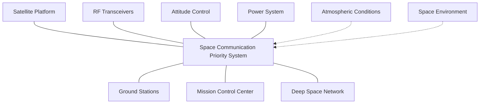
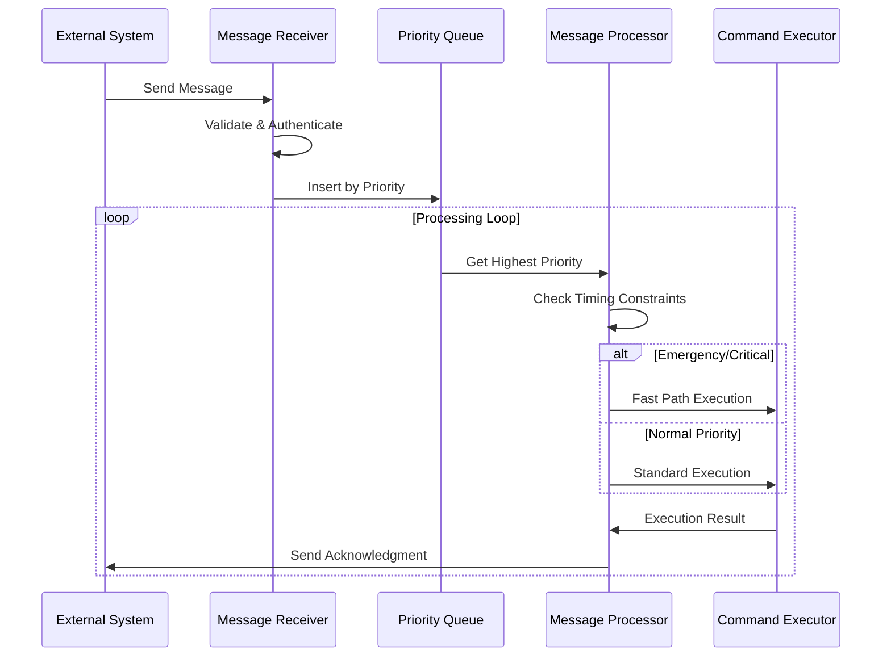
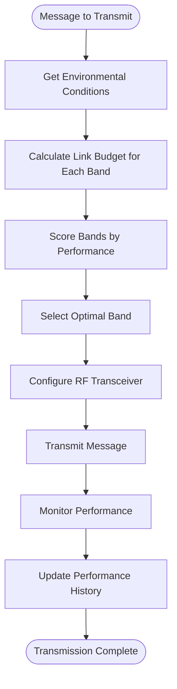

# Software Architecture Document (SAD)

**Space Communication Priority System**

**Document ID:** SAD-SCPS-001
**Version:** 1.0
**Date:** September 9, 2025
**Traceability:** Based on SRS-SCPS-001 and SDD-SCPS-001

---

## Table of Contents

1. [Introduction](#1-introduction)
2. [Architectural Overview](#2-architectural-overview)
3. [System Context](#3-system-context)
4. [Logical Architecture](#4-logical-architecture)
5. [Physical Architecture](#5-physical-architecture)
6. [Deployment Architecture](#6-deployment-architecture)
7. [Quality Attributes](#7-quality-attributes)
8. [Architectural Decisions](#8-architectural-decisions)
9. [Risks and Mitigation](#9-risks-and-mitigation)
10. [Future Considerations](#10-future-considerations)

---

## 1. Introduction

### 1.1 Purpose

This document describes the software architecture for the Space Communication Priority System (SCPS), providing a comprehensive view of the system structure, components, and their relationships.

### 1.2 Scope

The architecture encompasses all software components from embedded satellite firmware to ground station systems, including:

- Real-time priority-based message processing
- Multi-band frequency communication
- Atmospheric effects simulation
- Hardware abstraction layers
- Safety and reliability mechanisms

### 1.3 Stakeholders

- **Systems Engineers**: Overall system design and integration
- **Software Developers**: Component implementation and testing
- **Mission Planners**: Operational requirements and constraints
- **Quality Assurance**: Verification and validation processes

---

## 2. Architectural Overview

### 2.1 Architectural Style

**Requirement Traceability**: REQ-FN-010 (Real-Time Constraints)

The SCPS employs a **layered event-driven architecture** with the following characteristics:

- **Event-Driven Processing**: Asynchronous message handling using Embassy runtime
- **Priority-Based Scheduling**: Real-time task prioritization
- **Modular Design**: Clean separation of concerns
- **Hardware Abstraction**: Platform-independent core logic

### 2.2 Key Architectural Principles

1. **Real-Time First**: All design decisions prioritize timing constraints
2. **Safety Critical**: Fault tolerance and graceful degradation
3. **Resource Constrained**: Embedded system optimization
4. **Modular**: Loose coupling between components
5. **Standards Compliant**: CCSDS and NASA standards adherence

### 2.3 Technology Stack Summary

```
┌─────────────────────────────────────┐
│          Applications               │
├─────────────────────────────────────┤
│     Space Communication API        │
├─────────────────────────────────────┤
│     Embassy Async Runtime          │
├─────────────────────────────────────┤
│     Hardware Abstraction Layer     │
├─────────────────────────────────────┤
│     ARM Cortex-M / Linux Kernel    │
└─────────────────────────────────────┘
```

---

## 3. System Context

### 3.1 External Systems

**Requirement Traceability**: REQ-IF-001 (RF Transceiver Interface), REQ-IF-002 (CCSDS Compliance)



### 3.2 System Boundaries

- **In Scope**: Message processing, frequency band management, communication protocols
- **Out of Scope**: Physical antenna control, orbital mechanics, payload operations
- **Interfaces**: RF transceivers, attitude systems, power management, ground networks

---

## 4. Logical Architecture

### 4.1 Component Hierarchy

**Requirement Traceability**: REQ-FN-001 through REQ-FN-010

```
space-data-project/
├── rust-workspace/
│   ├── satellite/          # Embedded satellite firmware
│   │   ├── src/
│   │   │   ├── main.rs     # REQ-FN-010: Embassy async runtime
│   │   │   ├── command.rs  # REQ-FN-002-006: Command processing
│   │   │   ├── hardware.rs # REQ-IF-001: RF transceiver interface
│   │   │   └── watchdog.rs # REQ-SF-002: Watchdog protection
│   │   └── Cargo.toml      # REQ-NF-005: ARM Cortex-M target
│   ├── ground/             # Ground station software
│   │   ├── src/
│   │   │   ├── main.rs     # Ground station entry point
│   │   │   ├── protocol.rs # REQ-IF-002: CCSDS compliance
│   │   │   └── gateway.rs  # Communication gateway
│   │   └── Cargo.toml      # x86-64 Linux target
│   ├── shared/             # Common library components
│   │   ├── src/
│   │   │   ├── messaging.rs # REQ-FN-001,009: Priority system
│   │   │   ├── types.rs    # Common data types
│   │   │   └── error.rs    # Error handling framework
│   │   └── Cargo.toml      # no_std compatibility
│   └── simulation/         # Frequency band simulation
│       ├── src/
│       │   ├── lib.rs      # REQ-FN-007,008: Multi-band simulation
│       │   └── physics.rs  # Atmospheric modeling
│       └── Cargo.toml      # Standard Rust target
└── docs/                   # Documentation
    ├── SOFTWARE_REQUIREMENTS_SPECIFICATION.md
    ├── SOFTWARE_DESIGN_DOCUMENT.md
    └── SOFTWARE_ARCHITECTURE_DOCUMENT.md
```

### 4.2 Layer Architecture

#### 4.2.1 Application Layer

**Components**: Command processors, telemetry collectors, system monitors

**Responsibilities**:
- Business logic implementation
- Mission-specific operations
- User interface abstractions

#### 4.2.2 Service Layer

**Components**: Communication manager, priority queue, frequency selector

**Responsibilities**:
- Core system services
- Inter-component communication
- Resource management

#### 4.2.3 Infrastructure Layer

**Components**: Embassy runtime, hardware drivers, error handling

**Responsibilities**:
- Platform-specific implementations
- Hardware abstraction
- System-level services

### 4.3 Component Interaction Patterns

#### 4.3.1 Priority-Based Message Flow

**Requirement Traceability**: REQ-FN-009 (Message Queue Management)



#### 4.3.2 Frequency Band Selection

**Requirement Traceability**: REQ-FN-007 (Multi-Band Communication)



---

## 5. Physical Architecture

### 5.1 Hardware Platforms

#### 5.1.1 Satellite Platform

**Requirement Traceability**: REQ-NF-002 (Memory Constraints), REQ-NF-005 (Cross-Platform Support)

```
┌─────────────────────────────────────┐
│         Satellite Computer          │
│  ┌─────────────────────────────┐    │
│  │   ARM Cortex-M7 MCU        │    │
│  │   - 64KB RAM               │    │
│  │   - 256KB Flash            │    │
│  │   - 168MHz Clock           │    │
│  └─────────────────────────────┘    │
│                                     │
│  ┌─────────────────────────────┐    │
│  │   RF Transceivers           │    │
│  │   - K/Ka/S/X/UHF Bands     │    │
│  │   - Software Defined Radio │    │
│  │   - Antenna Switch Matrix  │    │
│  └─────────────────────────────┘    │
│                                     │
│  ┌─────────────────────────────┐    │
│  │   Support Systems           │    │
│  │   - Attitude Sensors        │    │
│  │   - Power Management        │    │
│  │   - Thermal Control         │    │
│  └─────────────────────────────┘    │
└─────────────────────────────────────┘
```

#### 5.1.2 Ground Station Platform

```
┌─────────────────────────────────────┐
│       Ground Station Computer       │
│  ┌─────────────────────────────┐    │
│  │   x86-64 Linux Server      │    │
│  │   - 16GB+ RAM              │    │
│  │   - Multi-core CPU         │    │
│  │   - High-speed Storage     │    │
│  └─────────────────────────────┘    │
│                                     │
│  ┌─────────────────────────────┐    │
│  │   RF Equipment              │    │
│  │   - Large Dish Antennas    │    │
│  │   - Multi-band Receivers   │    │
│  │   - Signal Processing      │    │
│  └─────────────────────────────┘    │
│                                     │
│  ┌─────────────────────────────┐    │
│  │   Network Infrastructure    │    │
│  │   - Mission Control Links  │    │
│  │   - Internet Connectivity  │    │
│  │   - Backup Communications  │    │
│  └─────────────────────────────┘    │
└─────────────────────────────────────┘
```

### 5.2 Network Topology

**Requirement Traceability**: REQ-FN-007 (Multi-Band Communication)

```
     Space Segment                    Ground Segment

    ┌─────────────┐                 ┌─────────────┐
    │  Satellite  │◄────────────────┤Ground Station│
    │    SCPS     │  K/Ka/S/X/UHF   │    SCPS     │
    └─────────────┘                 └─────────────┘
           │                               │
           │                               │
           ▼                               ▼
    ┌─────────────┐                 ┌─────────────┐
    │   Backup    │                 │   Mission   │
    │ Satellite   │                 │   Control   │
    └─────────────┘                 └─────────────┘
                                           │
                                           ▼
                                    ┌─────────────┐
                                    │    Deep     │
                                    │   Space     │
                                    │   Network   │
                                    └─────────────┘
```

---

## 6. Deployment Architecture

### 6.1 Embedded Deployment

**Requirement Traceability**: REQ-NF-002 (Memory Constraints)

```rust
// memory.x - Embedded memory layout
MEMORY
{
    FLASH : ORIGIN = 0x08000000, LENGTH = 256K  // REQ-NF-002
    RAM   : ORIGIN = 0x20000000, LENGTH = 64K   // REQ-NF-002
}

// Memory allocation strategy
Stack Size:      8KB   (15% of RAM)
Heap Size:       16KB  (25% of RAM)
Message Queue:   8KB   (12.5% of RAM)
Communication:   4KB   (6.25% of RAM)
System Reserve:  28KB  (41.25% of RAM)
```

### 6.2 Ground Station Deployment

```yaml
# Docker Compose deployment
version: '3.8'
services:
  scps-gateway:
    image: scps-ground:latest
    ports:
      - "8080:8080"     # Web interface
      - "5000:5000"     # API endpoint
    volumes:
      - ./config:/app/config
      - ./logs:/app/logs
    environment:
      - RUST_LOG=info
      - SCPS_MODE=ground_station

  simulation:
    image: scps-simulation:latest
    ports:
      - "3000:3000"     # Simulation interface
    volumes:
      - ./simulation-data:/app/data
    environment:
      - RUST_LOG=debug
```

### 6.3 Development Environment

```toml
# .cargo/config.toml
[target.thumbv7em-none-eabihf]
runner = "probe-run --chip STM32F767ZI"
rustflags = [
    "-C", "link-arg=-Tlink.x",
    "-C", "link-arg=-Tdefmt.x",
]

[build]
target = "thumbv7em-none-eabihf"    # REQ-NF-005: ARM Cortex-M target

[env]
DEFMT_LOG = "debug"
```

---

## 7. Quality Attributes

### 7.1 Real-Time Performance

**Requirement Traceability**: REQ-FN-010 (Real-Time Constraints)

**Architectural Strategies**:

- **Priority-based Scheduling**: Embassy async runtime with deterministic task scheduling
- **Lock-free Data Structures**: Heapless collections to avoid blocking
- **Memory Pre-allocation**: Static allocation to prevent runtime allocation delays
- **Interrupt-driven Communication**: Hardware interrupts for critical events

**Quality Metrics**:
- Emergency commands: <1ms response time
- Critical commands: <10ms response time
- Memory allocation: Zero dynamic allocation in flight code
- Task switching: <100μs overhead

### 7.2 Reliability

**Requirement Traceability**: REQ-NF-003 (System Availability), REQ-SF-002 (Watchdog Protection)

**Architectural Strategies**:

- **Watchdog Timers**: Hardware and software watchdogs at multiple levels
- **Redundancy**: Backup communication paths and failover mechanisms
- **Error Recovery**: Graceful degradation and automatic restart capabilities
- **Health Monitoring**: Continuous system health assessment

**Quality Metrics**:
- System availability: 99.99%
- Mean time between failures: >8760 hours
- Recovery time: <30 seconds
- Error detection coverage: >95%

### 7.3 Modifiability

**Architectural Strategies**:

- **Layer Separation**: Clear boundaries between hardware and software layers
- **Interface Abstraction**: Hardware abstraction layer for platform independence
- **Configuration-driven**: Externalized configuration for operational parameters
- **Modular Design**: Independent component compilation and testing

### 7.4 Security

**Requirement Traceability**: REQ-SC-001 (Message Authentication), REQ-SC-002 (Encryption Requirements)

**Architectural Strategies**:

- **Defense in Depth**: Multiple security layers from hardware to application
- **Cryptographic Protection**: AES-256-GCM encryption for all communications
- **Authentication Framework**: Digital signatures and timestamp validation
- **Secure Boot**: Verified boot process with signed firmware images

---

## 8. Architectural Decisions

### 8.1 Key Decisions

#### AD-001: Embassy Async Runtime

**Decision**: Use Embassy async runtime for embedded real-time processing

**Rationale**:
- Provides deterministic task scheduling required for REQ-FN-010
- Memory-efficient async operations for embedded constraints (REQ-NF-002)
- Growing ecosystem support for space-qualified hardware

**Alternatives Considered**:
- RTOS (Real-Time Operating System): Higher memory overhead
- Bare-metal polling: Poor scalability and maintainability

#### AD-002: Rust Programming Language

**Decision**: Implement entire system in Rust

**Rationale**:
- Memory safety without garbage collection overhead
- Zero-cost abstractions suitable for embedded systems
- Strong type system prevents common space software errors
- Growing NASA adoption for flight software

**Alternatives Considered**:
- C/C++: Higher risk of memory safety issues
- Ada: Limited embedded ecosystem support

#### AD-003: Priority Queue Implementation

**Decision**: Use binary heap-based priority queue with heapless collections

**Rationale**:
- O(log n) insertion and removal performance
- No dynamic allocation for embedded compatibility (REQ-NF-002)
- Built-in priority ordering support

**Alternatives Considered**:
- Linked list: O(n) insertion performance
- Array-based: O(n) removal performance

### 8.2 Trade-off Analysis

| Quality Attribute | Decision Impact | Trade-offs |
|-------------------|----------------|------------|
| Performance | Embassy async runtime | Higher learning curve vs. better performance |
| Memory Efficiency | Heapless collections | Limited capacity vs. predictable memory usage |
| Safety | Rust language | Development complexity vs. memory safety |
| Portability | Hardware abstraction | Additional layer vs. platform independence |

---

## 9. Risks and Mitigation

### 9.1 Technical Risks

#### Risk-001: Real-Time Deadline Misses

**Probability**: Medium
**Impact**: High
**Description**: System fails to meet critical timing constraints

**Mitigation Strategies**:
- Comprehensive timing analysis during design phase
- Hardware-in-the-loop testing with realistic workloads
- Degraded mode operation for overload conditions
- Continuous performance monitoring in flight

#### Risk-002: Memory Exhaustion

**Probability**: Low
**Impact**: High
**Description**: System runs out of available memory

**Mitigation Strategies**:
- Static memory allocation analysis
- Memory pool management with overflow detection
- Configurable message queue sizes
- Emergency memory recovery procedures

#### Risk-003: Communication Link Failures

**Probability**: Medium
**Impact**: Medium
**Description**: Atmospheric conditions degrade communication performance

**Mitigation Strategies**:
- Multi-band frequency diversity
- Adaptive coding and modulation
- Store-and-forward capability
- Automatic band switching algorithms

### 9.2 Operational Risks

#### Risk-004: Configuration Errors

**Probability**: Medium
**Impact**: Medium
**Description**: Incorrect system configuration leads to operational issues

**Mitigation Strategies**:
- Configuration validation at startup
- Default safe configuration values
- Configuration change logging and rollback
- Ground-commanded reconfiguration capability

---

## 10. Future Considerations

### 10.1 Scalability

**Horizontal Scaling**: Support for multi-satellite constellations

- Distributed message routing algorithms
- Inter-satellite link support
- Constellation-wide coordination protocols

**Vertical Scaling**: Enhanced processing capabilities

- Support for higher-performance embedded processors
- Increased memory capacity utilization
- Advanced signal processing algorithms

### 10.2 Technology Evolution

**Next-Generation Standards**:
- CCSDS File Delivery Protocol version 5
- Post-quantum cryptography implementation
- Advanced error correction codes

**Platform Modernization**:
- RISC-V processor support
- WebAssembly runtime for portable applications
- AI/ML integration for adaptive communications

### 10.3 Mission Adaptability

**Configurable Architecture**:
- Plugin-based command processors
- Mission-specific protocol adapters
- Dynamically loadable frequency band definitions

**Cross-Mission Reuse**:
- Generic communication framework
- Standardized hardware interfaces
- Mission-independent core services

---

## Appendix A: Architecture Views

### A.1 4+1 Architectural Views Summary

| View | Focus | Key Diagrams | Stakeholders |
|------|-------|--------------|--------------|
| **Logical View** | Functionality | Component diagrams, Class diagrams | Developers, Architects |
| **Process View** | Runtime behavior | Sequence diagrams, Activity diagrams | Integrators, Testers |
| **Physical View** | Hardware mapping | Deployment diagrams, Network topology | System Engineers |
| **Development View** | Source organization | Package diagrams, Module structure | Developers, Build Engineers |
| **Use Case View** | User scenarios | Use case diagrams, Story maps | Mission Planners, Users |

### A.2 Architecture Compliance Checklist

- [ ] **REQ-FN-001**: Priority classification implemented in MessagePriority enum
- [ ] **REQ-FN-010**: Real-time constraints enforced by Embassy async runtime
- [ ] **REQ-NF-002**: Memory constraints satisfied by heapless collections
- [ ] **REQ-NF-005**: Cross-platform support via hardware abstraction layer
- [ ] **REQ-SF-002**: Watchdog protection implemented at multiple levels
- [ ] **REQ-SC-001**: Message authentication framework integrated
- [ ] **REQ-IF-001**: RF transceiver interface abstracted for hardware independence

---

**Document Approval:**

| Role | Name | Date | Signature |
|------|------|------|-----------|
| Chief Architect | [Name] | [Date] | [Signature] |
| Systems Engineer | [Name] | [Date] | [Signature] |
| Mission Manager | [Name] | [Date] | [Signature] |
| Quality Assurance | [Name] | [Date] | [Signature] |

---

**Document History:**

| Version | Date | Author | Changes |
|---------|------|--------|---------|
| 1.0 | Sept 9, 2025 | Chief Architect | Initial architecture document |
