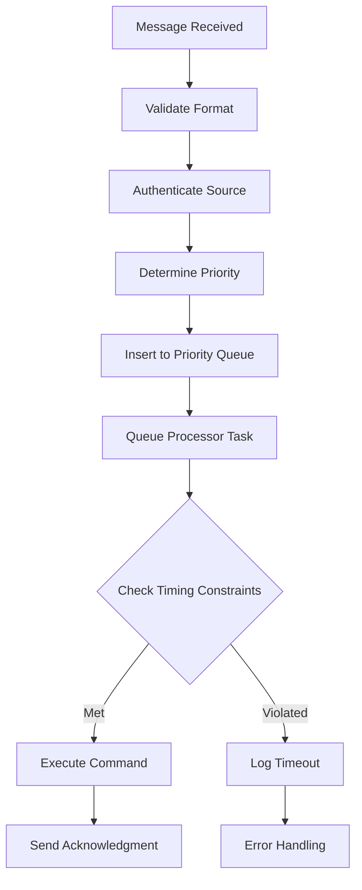

# Software Design Document (SDD)

**Space Communication Priority System**

**Document ID:** SDD-SCPS-001
**Version:** 1.0
**Date:** September 9, 2025
**Traceability:** Based on SRS-SCPS-001

---

## Table of Contents

1. [Introduction](#1-introduction)
2. [System Architecture](#2-system-architecture)
3. [Component Design](#3-component-design)
4. [Interface Design](#4-interface-design)
5. [Data Design](#5-data-design)
6. [Process Design](#6-process-design)
7. [Error Handling](#7-error-handling)
8. [Performance Design](#8-performance-design)
9. [Security Design](#9-security-design)
10. [Deployment Design](#10-deployment-design)

---

## 1. Introduction

### 1.1 Purpose

This document provides the architectural and detailed design for the Space Communication Priority System (SCPS). It serves as a blueprint for implementation and satisfies requirements defined in SRS-SCPS-001.

### 1.2 Design Principles

1. **Real-Time Performance**: All designs prioritize timing constraints
2. **Embedded Optimization**: Memory and power efficiency for space hardware
3. **Reliability**: Fault tolerance and graceful degradation
4. **Modularity**: Clean separation of concerns and reusable components
5. **Standards Compliance**: CCSDS and NASA standards adherence

### 1.3 Technology Stack

- **Language**: Rust (stable 1.75+)
- **Async Runtime**: Embassy for embedded targets
- **Serialization**: Serde with compact binary formats
- **Collections**: Heapless for no_std compatibility
- **Testing**: Built-in Rust testing framework

---

## 2. System Architecture

### 2.1 High-Level Architecture

```
┌─────────────────┐    ┌─────────────────┐    ┌─────────────────┐
│   Ground        │    │   Satellite     │    │   Simulation    │
│   Station       │◄──►│   System        │◄──►│   Environment   │
│                 │    │                 │    │                 │
└─────────────────┘    └─────────────────┘    └─────────────────┘
        │                        │                        │
        └────────────────────────┼────────────────────────┘
                                 │
                    ┌─────────────────┐
                    │   Shared        │
                    │   Library       │
                    └─────────────────┘
```

### 2.2 Component Architecture

**Requirement Traceability**: REQ-NF-005 (Cross-Platform Support)

The system is decomposed into four main workspace components:

1. **Satellite Module** (`satellite/`)
   - **Purpose**: Embedded firmware for spacecraft
   - **Requirements**: REQ-FN-001, REQ-FN-002, REQ-FN-009, REQ-FN-010
   - **Runtime**: Embassy async executor
   - **Constraints**: 64KB RAM, 256KB Flash

2. **Ground Station Module** (`ground/`)
   - **Purpose**: Ground-based communication interface
   - **Requirements**: REQ-FN-007, REQ-IF-002
   - **Platform**: Linux x86-64
   - **Features**: Full CCSDS protocol stack

3. **Shared Library** (`shared/`)
   - **Purpose**: Common types and protocols
   - **Requirements**: REQ-FN-001 through REQ-FN-006
   - **Compatibility**: `no_std` for embedded use
   - **Features**: Message types, priority definitions

4. **Simulation Environment** (`simulation/`)
   - **Purpose**: Frequency band and atmospheric modeling
   - **Requirements**: REQ-FN-007, REQ-FN-008
   - **Platform**: Standard Rust with full std library
   - **Features**: Physics-based RF modeling

### 2.3 Deployment Architecture

**Requirement Traceability**: REQ-NF-003 (System Availability)

```
Space Segment:           Ground Segment:
┌─────────────┐         ┌─────────────┐
│ Satellite   │         │ Ground      │
│ ┌─────────┐ │   RF    │ Station     │
│ │ SCPS    │ │◄──────► │ ┌─────────┐ │
│ │ Firmware│ │         │ │ SCPS    │ │
│ └─────────┘ │         │ │ Gateway │ │
│ ARM Cortex  │         │ └─────────┘ │
│ M4/M7       │         │ Linux x64   │
└─────────────┘         └─────────────┘
```

---

## 3. Component Design

### 3.1 Message Priority Component

**File**: `shared/src/messaging.rs`
**Requirement Traceability**: REQ-FN-001 (Priority Classification)

#### 3.1.1 Priority Enumeration Design

```rust
#[derive(Debug, Clone, Copy, PartialEq, Eq, PartialOrd, Ord, Serialize, Deserialize)]
pub enum MessagePriority {
    Low = 1,      // REQ-FN-006: Low Priority Commands
    Medium = 2,   // REQ-FN-005: Medium Priority Commands
    High = 3,     // REQ-FN-004: High Priority Commands
    Critical = 4, // REQ-FN-003: Critical Command Set
    Emergency = 5 // REQ-FN-002: Emergency Command Set
}
```

**Design Rationale**:

- Numeric values enable direct comparison and sorting
- `PartialOrd`/`Ord` traits provide automatic priority ordering
- Serde support enables serialization across communication links
- Copy semantics optimize performance for frequent comparisons

#### 3.1.2 Message Structure Design

**Requirement Traceability**: REQ-FN-009 (Message Queue Management)

```rust
#[derive(Debug, Clone, Serialize, Deserialize)]
pub struct Message {
    pub id: u32,                    // Unique message identifier
    pub priority: MessagePriority,  // Priority level for processing
    pub timestamp: u64,             // Creation timestamp (microseconds)
    pub source: MessageSource,      // Origin of the message
    pub destination: MessageDest,   // Target destination
    pub payload: MessagePayload,    // Command or data content
    pub checksum: u32,              // Integrity verification
}
```

**Design Features**:

- Timestamp enables age-based processing and timeout detection
- Source/destination routing for multi-node networks
- Checksum provides basic integrity checking
- Compact representation for bandwidth efficiency

### 3.2 Command Processing Component

**File**: `satellite/src/command.rs`
**Requirement Traceability**: REQ-FN-002 through REQ-FN-006

#### 3.2.1 Command Type Hierarchy

```rust
#[derive(Debug, Clone, Serialize, Deserialize)]
pub enum CommandType {
    // REQ-FN-002: Emergency Commands (Priority 5)
    EmergencyAbort,
    EmergencyHalt,
    ActivateSafeMode,
    EmergencyPowerDown,
    EmergencyAttitudeRecovery,

    // REQ-FN-003: Critical Commands (Priority 4)
    AbortMission,
    HaltSubsystem,
    CollisionAvoidance,
    AttitudeControl,
    SwitchCommBackup,
    ResetSystem,

    // Additional command sets...
}
```

#### 3.2.2 Command Executor Design

**Requirement Traceability**: REQ-FN-010 (Real-Time Constraints)

```rust
pub struct CommandExecutor {
    priority_queue: PriorityQueue<Message>,
    timing_monitor: TimingMonitor,
    safety_checker: SafetyChecker,
}

impl CommandExecutor {
    pub async fn execute_command(&mut self, cmd: CommandType) -> Result<()> {
        // Timing constraint validation per REQ-FN-010
        let start_time = self.timing_monitor.now();

        // Safety validation per REQ-SF-001
        self.safety_checker.validate_command(&cmd)?;

        // Execute with priority-based scheduling
        let result = match cmd.priority() {
            MessagePriority::Emergency => self.execute_emergency(cmd).await,
            MessagePriority::Critical => self.execute_critical(cmd).await,
            // Handle other priorities...
        };

        // Verify timing constraints met
        let elapsed = self.timing_monitor.elapsed(start_time);
        self.timing_monitor.verify_constraints(cmd.priority(), elapsed)?;

        result
    }
}
```

### 3.3 Frequency Band Component

**File**: `simulation/src/frequency.rs`
**Requirement Traceability**: REQ-FN-007 (Multi-Band Communication)

#### 3.3.1 Band Characteristics Design

```rust
#[derive(Debug, Clone, Copy, Serialize, Deserialize)]
pub enum BandType {
    KBand,   // REQ-FN-007: 20-30 GHz
    KaBand,  // REQ-FN-007: 26.5-40 GHz
    SBand,   // REQ-FN-007: 2-4 GHz
    XBand,   // REQ-FN-007: 8-12 GHz
    UHFBand, // REQ-FN-007: 0.3-3 GHz
}

#[derive(Debug, Clone)]
pub struct BandCharacteristics {
    pub frequency_range: FrequencyRange,
    pub max_data_rate: u32,        // REQ-PF-002: Data Transfer Rates
    pub weather_sensitivity: f32,   // REQ-FN-008: Atmospheric Effects
    pub power_efficiency: f32,
    pub atmospheric_absorption: f32,
}
```

#### 3.3.2 Atmospheric Effects Model

**Requirement Traceability**: REQ-FN-008 (Frequency Band Simulation)

```rust
#[derive(Debug, Clone)]
pub struct AtmosphericModel {
    pub rain_rate: f32,      // mm/hr
    pub humidity: f32,       // %
    pub temperature: f32,    // Celsius
    pub pressure: f32,       // kPa
}

impl AtmosphericModel {
    pub fn calculate_path_loss(&self, band: BandType, distance: f32) -> f32 {
        // ITU-R P.676 gaseous absorption model
        let gaseous_loss = self.gaseous_absorption(band);

        // ITU-R P.838 rain attenuation model
        let rain_loss = self.rain_attenuation(band);

        // Free space path loss
        let free_space_loss = 20.0 * (distance / 1000.0).log10();

        gaseous_loss + rain_loss + free_space_loss
    }
}
```

### 3.4 Real-Time Task Manager

**File**: `satellite/src/main.rs`
**Requirement Traceability**: REQ-FN-010 (Real-Time Constraints)

#### 3.4.1 Embassy Task Architecture

```rust
#[embassy_executor::main]
async fn main(spawner: Spawner) {
    // REQ-FN-010: Real-time task spawning
    spawner.spawn(priority_processor_task()).unwrap();  // Highest priority
    spawner.spawn(command_executor_task()).unwrap();    // High priority
    spawner.spawn(telemetry_task()).unwrap();           // Medium priority
    spawner.spawn(housekeeping_task()).unwrap();        // Low priority

    // REQ-SF-002: Watchdog monitoring
    spawner.spawn(watchdog_task()).unwrap();

    // Main loop handles system coordination
    loop {
        system_health_check().await;
        Timer::after(Duration::from_millis(100)).await;
    }
}
```

#### 3.4.2 Priority Queue Implementation

**Requirement Traceability**: REQ-FN-009 (Message Queue Management)

```rust
use heapless::binary_heap::{BinaryHeap, Max};

pub struct PriorityQueue<T> {
    heap: BinaryHeap<PriorityItem<T>, Max, 1000>, // REQ-FN-009: 1000 message capacity
    overflow_policy: OverflowPolicy,
}

#[derive(Debug, Clone)]
struct PriorityItem<T> {
    priority: MessagePriority,
    timestamp: u64,
    item: T,
}

impl<T> PartialOrd for PriorityItem<T> {
    fn partial_cmp(&self, other: &Self) -> Option<Ordering> {
        // Higher priority first, then FIFO within priority
        match self.priority.cmp(&other.priority) {
            Ordering::Equal => other.timestamp.partial_cmp(&self.timestamp),
            other => Some(other),
        }
    }
}
```

---

## 4. Interface Design

### 4.1 Hardware Abstraction Layer

**Requirement Traceability**: REQ-IF-001 (RF Transceiver Interface)

#### 4.1.1 RF Interface Design

```rust
pub trait RfTransceiver {
    async fn set_frequency_band(&mut self, band: BandType) -> Result<()>;
    async fn set_power_level(&mut self, dbm: f32) -> Result<()>;
    async fn get_signal_quality(&self) -> Result<SignalQuality>;
    async fn transmit(&mut self, data: &[u8]) -> Result<()>;
    async fn receive(&mut self) -> Result<Vec<u8>>;
}

#[derive(Debug, Clone)]
pub struct SignalQuality {
    pub snr: f32,           // Signal-to-noise ratio (dB)
    pub rssi: f32,          // Received signal strength (dBm)
    pub ber: f32,           // Bit error rate
    pub frequency: f32,     // Current frequency (Hz)
}
```

### 4.2 CCSDS Protocol Interface

**Requirement Traceability**: REQ-IF-002 (CCSDS Compliance)

#### 4.2.1 Space Packet Protocol

```rust
#[derive(Debug, Clone, Serialize, Deserialize)]
pub struct SpacePacket {
    pub primary_header: PrimaryHeader,
    pub secondary_header: Option<SecondaryHeader>,
    pub data_field: Vec<u8>,
}

#[derive(Debug, Clone, Serialize, Deserialize)]
pub struct PrimaryHeader {
    pub packet_version: u8,      // Always 0 per CCSDS
    pub packet_type: PacketType, // TM or TC
    pub secondary_header_flag: bool,
    pub apid: u16,              // Application Process ID
    pub sequence_flags: SequenceFlags,
    pub sequence_count: u16,
    pub packet_length: u16,
}
```

---

## 5. Data Design

### 5.1 Message Storage Design

**Requirement Traceability**: REQ-NF-002 (Memory Constraints)

#### 5.1.1 Memory Layout Optimization

```rust
// Compact message representation for embedded systems
#[repr(C, packed)]
#[derive(Debug, Clone, Copy)]
pub struct CompactMessage {
    id: u32,                    // 4 bytes
    priority: u8,               // 1 byte (instead of enum)
    timestamp: u32,             // 4 bytes (reduced precision)
    source: u8,                 // 1 byte (node ID)
    destination: u8,            // 1 byte (node ID)
    command_type: u16,          // 2 bytes (command enum)
    payload_length: u16,        // 2 bytes
    checksum: u16,              // 2 bytes (CRC-16)
}
// Total: 17 bytes per message header
```

### 5.2 Configuration Data

**Requirement Traceability**: REQ-FN-004 (High Priority Commands)

#### 5.2.1 System Configuration Structure

```rust
#[derive(Debug, Clone, Serialize, Deserialize)]
pub struct SystemConfig {
    pub communication: CommunicationConfig,
    pub power: PowerConfig,
    pub attitude: AttitudeConfig,
    pub payload: PayloadConfig,
}

#[derive(Debug, Clone, Serialize, Deserialize)]
pub struct CommunicationConfig {
    pub default_band: BandType,
    pub power_levels: HashMap<BandType, f32>,
    pub timeout_ms: HashMap<MessagePriority, u32>,
    pub max_retries: u8,
}
```

---

## 6. Process Design

### 6.1 Message Processing Flow

**Requirement Traceability**: REQ-FN-009, REQ-FN-010

#### 6.1.1 Priority-Based Processing Sequence



#### 6.1.2 Emergency Processing Path

**Requirement Traceability**: REQ-FN-002 (Emergency Commands)

```rust
pub async fn emergency_fast_path(cmd: EmergencyCommand) -> Result<()> {
    // REQ-FN-002: <1ms processing time
    let start = Instant::now();

    // Skip normal queue for emergency commands
    match cmd {
        EmergencyCommand::EmergencyAbort => {
            abort_all_operations().await?;
        },
        EmergencyCommand::ActivateSafeMode => {
            activate_safe_mode().await?;
        },
        // Handle other emergency commands...
    }

    let elapsed = start.elapsed();
    assert!(elapsed.as_millis() < 1, "Emergency command timing violation");

    Ok(())
}
```

### 6.2 Frequency Band Selection Algorithm

**Requirement Traceability**: REQ-FN-007 (Multi-Band Communication)

#### 6.2.1 Adaptive Band Selection

```rust
pub struct BandSelector {
    weather_monitor: WeatherMonitor,
    link_budget: LinkBudgetCalculator,
    performance_history: PerformanceHistory,
}

impl BandSelector {
    pub async fn select_optimal_band(&self, data_requirement: DataRequirement)
        -> Result<BandType> {

        let current_conditions = self.weather_monitor.get_conditions().await?;
        let mut band_scores = Vec::new();

        for band in BandType::all() {
            let predicted_performance = self.link_budget.calculate(
                band,
                &current_conditions,
                &data_requirement
            )?;

            let historical_reliability = self.performance_history
                .get_reliability(band, &current_conditions);

            let score = predicted_performance * historical_reliability;
            band_scores.push((band, score));
        }

        // Select band with highest composite score
        band_scores.sort_by(|a, b| b.1.partial_cmp(&a.1).unwrap());
        Ok(band_scores[0].0)
    }
}
```

---

## 7. Error Handling

### 7.1 Error Classification

**Requirement Traceability**: REQ-NF-004 (Fault Tolerance)

#### 7.1.1 Error Type Hierarchy

```rust
#[derive(Debug, Clone, thiserror::Error)]
pub enum SystemError {
    #[error("Communication error: {0}")]
    Communication(#[from] CommError),

    #[error("Command execution error: {0}")]
    Command(#[from] CommandError),

    #[error("Hardware error: {0}")]
    Hardware(#[from] HardwareError),

    #[error("Timing constraint violation: expected {expected}ms, actual {actual}ms")]
    TimingViolation { expected: u32, actual: u32 },

    #[error("Resource exhaustion: {resource}")]
    ResourceExhaustion { resource: String },
}
```

### 7.2 Recovery Strategies

**Requirement Traceability**: REQ-SF-002 (Watchdog Protection)

#### 7.2.1 Automatic Recovery System

```rust
pub struct RecoveryManager {
    recovery_policies: HashMap<ErrorType, RecoveryPolicy>,
    failure_counters: HashMap<ComponentId, u32>,
    watchdog: WatchdogTimer,
}

#[derive(Debug, Clone)]
pub enum RecoveryPolicy {
    Retry { max_attempts: u32, backoff_ms: u32 },
    Restart { component: ComponentId },
    Failover { backup_component: ComponentId },
    SafeMode,
}

impl RecoveryManager {
    pub async fn handle_error(&mut self, error: SystemError) -> Result<()> {
        let policy = self.recovery_policies
            .get(&error.error_type())
            .cloned()
            .unwrap_or(RecoveryPolicy::SafeMode);

        match policy {
            RecoveryPolicy::Retry { max_attempts, backoff_ms } => {
                self.execute_retry_policy(error, max_attempts, backoff_ms).await
            },
            RecoveryPolicy::SafeMode => {
                self.activate_safe_mode().await
            },
            // Handle other policies...
        }
    }
}
```

---

## 8. Performance Design

### 8.1 Real-Time Performance

**Requirement Traceability**: REQ-PF-001 (Command Response Time)

#### 8.1.1 Timing Measurement Framework

```rust
pub struct TimingMonitor {
    start_times: HashMap<u32, Instant>,
    performance_stats: PerformanceStatistics,
}

impl TimingMonitor {
    pub fn start_measurement(&mut self, command_id: u32) {
        self.start_times.insert(command_id, Instant::now());
    }

    pub fn end_measurement(&mut self, command_id: u32) -> Option<Duration> {
        self.start_times.remove(&command_id)
            .map(|start| {
                let elapsed = start.elapsed();
                self.performance_stats.record_timing(command_id, elapsed);
                elapsed
            })
    }

    pub fn verify_constraints(&self, priority: MessagePriority, elapsed: Duration)
        -> Result<()> {
        let max_allowed = match priority {
            MessagePriority::Emergency => Duration::from_millis(1),   // REQ-FN-010
            MessagePriority::Critical => Duration::from_millis(10),   // REQ-FN-010
            MessagePriority::High => Duration::from_millis(100),      // REQ-FN-010
            MessagePriority::Medium => Duration::from_millis(1000),   // REQ-FN-010
            MessagePriority::Low => Duration::from_millis(10000),     // REQ-FN-010
        };

        if elapsed > max_allowed {
            return Err(SystemError::TimingViolation {
                expected: max_allowed.as_millis() as u32,
                actual: elapsed.as_millis() as u32,
            });
        }

        Ok(())
    }
}
```

### 8.2 Memory Management

**Requirement Traceability**: REQ-NF-002 (Memory Constraints)

#### 8.2.1 Memory Pool Allocator

```rust
use heapless::pool::{Pool, Node};

pub struct MessagePool {
    pool: Pool<Node<[u8; 64]>>,  // 64-byte message nodes
    memory: [Node<[u8; 64]>; 1000], // 1000 message capacity
}

impl MessagePool {
    pub fn new() -> Self {
        let mut pool = Pool::new();
        let memory = [Node::new(); 1000];

        // Initialize pool with static memory
        for node in &memory {
            pool.manage(node);
        }

        Self { pool, memory }
    }

    pub fn allocate_message(&mut self) -> Option<PooledMessage> {
        self.pool.alloc().map(PooledMessage::new)
    }
}
```

---

## 9. Security Design

### 9.1 Message Authentication

**Requirement Traceability**: REQ-SC-001 (Message Authentication)

#### 9.1.1 Authentication Framework

```rust
use sha2::{Sha256, Digest};
use ed25519_dalek::{Signature, Verifier, VerifyingKey};

pub struct MessageAuthenticator {
    public_keys: HashMap<NodeId, VerifyingKey>,
    private_key: Option<SigningKey>,
}

impl MessageAuthenticator {
    pub fn authenticate_message(&self, msg: &Message) -> Result<bool> {
        // REQ-SC-001: Verify digital signature
        let signature = Signature::from_bytes(&msg.signature)?;
        let public_key = self.public_keys
            .get(&msg.source)
            .ok_or(AuthError::UnknownSource)?;

        let message_bytes = msg.get_signed_content();
        public_key.verify(&message_bytes, &signature)
            .map(|_| true)
            .map_err(|_| AuthError::InvalidSignature.into())
    }

    pub fn check_timestamp(&self, msg: &Message) -> Result<()> {
        // REQ-SC-001: Prevent replay attacks
        let current_time = SystemTime::now().duration_since(UNIX_EPOCH)?.as_secs();
        let msg_time = msg.timestamp / 1_000_000; // Convert from microseconds

        if current_time.saturating_sub(msg_time) > 300 { // 5 minute window
            return Err(AuthError::TimestampExpired.into());
        }

        Ok(())
    }
}
```

### 9.2 Encryption Implementation

**Requirement Traceability**: REQ-SC-002 (Encryption Requirements)

#### 9.2.1 AES-GCM Encryption

```rust
use aes_gcm::{Aes256Gcm, KeyInit, Nonce};
use aes_gcm::aead::{Aead, NewAead};

pub struct MessageEncryption {
    cipher: Aes256Gcm,
    nonce_counter: u64,
}

impl MessageEncryption {
    pub fn encrypt_payload(&mut self, payload: &[u8]) -> Result<EncryptedPayload> {
        // REQ-SC-002: AES-256-GCM encryption
        let nonce = self.generate_nonce();
        let ciphertext = self.cipher.encrypt(&nonce, payload)
            .map_err(|_| EncryptionError::EncryptionFailed)?;

        Ok(EncryptedPayload {
            nonce: nonce.into(),
            ciphertext,
        })
    }

    pub fn decrypt_payload(&self, encrypted: &EncryptedPayload) -> Result<Vec<u8>> {
        let nonce = Nonce::from_slice(&encrypted.nonce);
        self.cipher.decrypt(nonce, encrypted.ciphertext.as_ref())
            .map_err(|_| EncryptionError::DecryptionFailed.into())
    }

    fn generate_nonce(&mut self) -> Nonce<12> {
        self.nonce_counter += 1;
        let mut nonce = [0u8; 12];
        nonce[4..12].copy_from_slice(&self.nonce_counter.to_be_bytes());
        *Nonce::from_slice(&nonce)
    }
}
```

---

## 10. Deployment Design

### 10.1 Build Configuration

**Requirement Traceability**: REQ-NF-005 (Cross-Platform Support)

#### 10.1.1 Target-Specific Configuration

```toml
# Cargo.toml for satellite module
[package]
name = "satellite"
edition = "2021"

[dependencies]
embassy-executor = { version = "0.5", features = ["arch-cortex-m", "executor-thread"] }
embassy-time = { version = "0.3", features = ["tick-hz-1_000_000"] }
embassy-sync = "0.5"
cortex-m = "0.7"
cortex-m-rt = "0.7"
space_comms_shared = { path = "../shared", default-features = false }

[profile.release]
opt-level = "s"      # Optimize for size
lto = true           # Link-time optimization
panic = "abort"      # Smaller panic handler
codegen-units = 1    # Better optimization

[[bin]]
name = "satellite"
test = false
bench = false
```

### 10.2 Memory Layout

**Requirement Traceability**: REQ-NF-002 (Memory Constraints)

#### 10.2.1 Embedded Memory Map

```rust
// memory.x - Linker script for embedded target
MEMORY
{
    /* REQ-NF-002: 256KB Flash, 64KB RAM constraints */
    FLASH : ORIGIN = 0x08000000, LENGTH = 256K
    RAM : ORIGIN = 0x20000000, LENGTH = 64K
}

/* Stack size allocation */
_stack_size = 8K;  /* 8KB for main stack */

/* Heap allocation for Embassy */
_heap_size = 16K;  /* 16KB for dynamic allocation */

/* Message queue memory */
_message_queue_size = 8K;  /* 8KB for priority queue */

/* Communication buffers */
_comm_buffer_size = 4K;    /* 4KB for RF communication */
```

### 10.3 Testing Strategy

**Requirement Traceability**: REQ-QL-001 (Test Coverage)

#### 10.3.1 Test Architecture

```rust
#[cfg(test)]
mod tests {
    use super::*;
    use embedded_test_harness::TestHarness;

    #[test]
    fn test_priority_ordering() {
        // REQ-FN-001: Priority Classification
        let mut queue = PriorityQueue::new();

        queue.push(Message::new(MessagePriority::Low, "low")).unwrap();
        queue.push(Message::new(MessagePriority::Emergency, "emergency")).unwrap();
        queue.push(Message::new(MessagePriority::Medium, "medium")).unwrap();

        assert_eq!(queue.pop().unwrap().payload, "emergency");
        assert_eq!(queue.pop().unwrap().payload, "medium");
        assert_eq!(queue.pop().unwrap().payload, "low");
    }

    #[tokio::test]
    async fn test_timing_constraints() {
        // REQ-FN-010: Real-Time Constraints
        let mut executor = CommandExecutor::new();
        let start = Instant::now();

        executor.execute_command(CommandType::EmergencyAbort).await.unwrap();

        let elapsed = start.elapsed();
        assert!(elapsed.as_millis() < 1, "Emergency command exceeded 1ms limit");
    }
}
```

#### 10.3.2 Hardware-in-the-Loop Testing

```rust
#[cfg(feature = "hardware-test")]
mod hardware_tests {
    use super::*;

    #[test]
    fn test_rf_transceiver_integration() {
        // REQ-IF-001: RF Transceiver Interface
        let mut transceiver = hardware::get_rf_transceiver();

        transceiver.set_frequency_band(BandType::XBand).unwrap();
        let quality = transceiver.get_signal_quality().unwrap();

        assert!(quality.snr > 10.0, "Insufficient signal quality");
        assert!(quality.frequency > 8_000_000_000.0, "X-Band frequency range");
        assert!(quality.frequency < 12_000_000_000.0, "X-Band frequency range");
    }
}
```

---

## Appendix A: Design Traceability Matrix

| Design Component | Requirements Satisfied | Implementation File | Test Coverage |
|------------------|----------------------|-------------------|---------------|
| MessagePriority enum | REQ-FN-001 | shared/messaging.rs | test_priority_ordering |
| Emergency Commands | REQ-FN-002 | satellite/command.rs | test_emergency_timing |
| Critical Commands | REQ-FN-003 | satellite/command.rs | test_critical_commands |
| High Priority Commands | REQ-FN-004 | satellite/command.rs | test_high_commands |
| Medium Priority Commands | REQ-FN-005 | satellite/command.rs | test_medium_commands |
| Low Priority Commands | REQ-FN-006 | satellite/command.rs | test_low_commands |
| Multi-Band Support | REQ-FN-007 | simulation/frequency.rs | test_band_switching |
| Frequency Simulation | REQ-FN-008 | simulation/atmospheric.rs | test_simulation_accuracy |
| Priority Queue | REQ-FN-009 | shared/messaging.rs | test_queue_management |
| Real-Time Timing | REQ-FN-010 | satellite/main.rs | test_timing_constraints |
| Memory Constraints | REQ-NF-002 | satellite/memory.rs | test_memory_usage |
| System Availability | REQ-NF-003 | satellite/recovery.rs | test_fault_tolerance |
| Cross-Platform | REQ-NF-005 | All modules | test_cross_compilation |
| RF Interface | REQ-IF-001 | satellite/hardware.rs | test_rf_integration |
| CCSDS Compliance | REQ-IF-002 | ground/protocol.rs | test_ccsds_compliance |

---

**Document Approval:**

| Role | Name | Date | Signature |
|------|------|------|-----------|
| Software Architect | [Name] | [Date] | [Signature] |
| Systems Engineer | [Name] | [Date] | [Signature] |
| Lead Developer | [Name] | [Date] | [Signature] |
| Quality Assurance | [Name] | [Date] | [Signature] |

---

**Document History:**

| Version | Date | Author | Changes |
|---------|------|--------|---------|
| 1.0 | Sept 9, 2025 | Software Architect | Initial design document |
